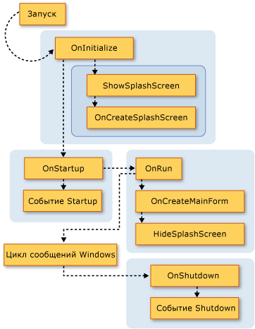
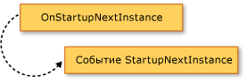
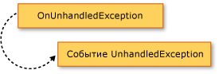

# Расширение модели приложения Visual Basic
[!INCLUDE[vs2017banner](../../../visual-basic/includes/vs2017banner.md)]

Модель приложения можно дополнять новыми функциональными возможностями, переопределяя члены `Overridable` класса <xref:Microsoft.VisualBasic.ApplicationServices.WindowsFormsApplicationBase>.  Этот способ позволяет настроить поведение модели приложения и добавлять вызовы собственных методов во время запуска и завершения работы приложения.  
  
## Наглядный обзор модели приложения  
 В этом разделе наглядно представлена последовательность вызовов функций в модели приложения Visual Basic.  В следующем разделе подробно описывается назначение каждой функции.  
  
 На следующем рисунке показана последовательность вызовов модели приложения в обычном приложении Windows Forms Visual Basic.  Последовательность начинается с вызова процедурой `Sub Main` метода <xref:Microsoft.VisualBasic.ApplicationServices.WindowsFormsApplicationBase.Run%2A>.  
  
   
  
 Модель приложения Visual Basic также предоставляет события <xref:Microsoft.VisualBasic.ApplicationServices.WindowsFormsApplicationBase.StartupNextInstance> и <xref:Microsoft.VisualBasic.ApplicationServices.WindowsFormsApplicationBase.UnhandledException>.  На следующем рисунке показан механизм возникновения этих событий.  
  
   
  
   
  
## Переопределение базовых методов  
 Метод <xref:Microsoft.VisualBasic.ApplicationServices.WindowsFormsApplicationBase.Run%2A> определяет порядок выполнения методов `Application`.  По умолчанию процедура для приложения Windows Forms `Sub Main` вызывает метод <xref:Microsoft.VisualBasic.ApplicationServices.WindowsFormsApplicationBase.Run%2A>.  
  
 В случае обычного приложения \(которое может запускаться в нескольких экземплярах\) или первого экземпляра приложения, допускающего запуск только одного экземпляра, метод <xref:Microsoft.VisualBasic.ApplicationServices.WindowsFormsApplicationBase.Run%2A> вызывает методы `Overridable` в следующем порядке:  
  
1.  <xref:Microsoft.VisualBasic.ApplicationServices.WindowsFormsApplicationBase.OnInitialize%2A>.  По умолчанию этот метод устанавливает стили оформления, стили отображения текста и текущий участник для основного потока приложения \(если приложение использует проверку подлинности Windows\) и вызывает метод `ShowSplashScreen`, если в командной строке не указан аргумент `/nosplash` или `-nosplash`.  
  
     Последовательность запуска приложения отменяется, если эта функция возвращает `False`.  Это может быть полезно, если существуют ситуации, в которых приложение не следует запускать.  
  
     Метод <xref:Microsoft.VisualBasic.ApplicationServices.WindowsFormsApplicationBase.OnInitialize%2A> вызывает следующие методы:  
  
    1.  <xref:Microsoft.VisualBasic.ApplicationServices.WindowsFormsApplicationBase.ShowSplashScreen%2A>.  Определяет, имеет ли приложение заставку и если это так, отображает заставку в отдельном потоке.  
  
         Метод <xref:Microsoft.VisualBasic.ApplicationServices.WindowsFormsApplicationBase.ShowSplashScreen%2A> содержит код, отображающий экран\-заставку как минимум в течение промежутка времени в миллисекундах, заданного свойством <xref:Microsoft.VisualBasic.ApplicationServices.WindowsFormsApplicationBase.MinimumSplashScreenDisplayTime%2A>.  Чтобы использовать эту функциональность, необходимо добавить заставку в приложение с помощью **Конструктора проектов** \(который устанавливает значение свойства `My.Application.MinimumSplashScreenDisplayTime` равным двум секундам\) либо задать свойство `My.Application.MinimumSplashScreenDisplayTime` в методе, который переопределяет метод <xref:Microsoft.VisualBasic.ApplicationServices.WindowsFormsApplicationBase.OnInitialize%2A> или <xref:Microsoft.VisualBasic.ApplicationServices.WindowsFormsApplicationBase.OnCreateSplashScreen%2A>.  Дополнительные сведения см. в разделе <xref:Microsoft.VisualBasic.ApplicationServices.WindowsFormsApplicationBase.MinimumSplashScreenDisplayTime%2A>.  
  
    2.  <xref:Microsoft.VisualBasic.ApplicationServices.WindowsFormsApplicationBase.OnCreateSplashScreen%2A>.  Позволяет конструктору породить код, инициализирующий заставку.  
  
         По умолчанию этот метод не делает ничего.  Если выбрать экран\-заставку для приложения в **конструкторе проектов** [!INCLUDE[vbprvb](../../../csharp/programming-guide/concepts/linq/includes/vbprvb-md.md)], конструктор переопределяет метод <xref:Microsoft.VisualBasic.ApplicationServices.WindowsFormsApplicationBase.OnCreateSplashScreen%2A> методом, задающим для свойства <xref:Microsoft.VisualBasic.ApplicationServices.WindowsFormsApplicationBase.SplashScreen%2A> новый экземпляр формы экрана\-заставки.  
  
2.  <xref:Microsoft.VisualBasic.ApplicationServices.WindowsFormsApplicationBase.OnStartup%2A>.  Предоставляет точку расширения для создания события `Startup`.  Последовательность запуска приложения останавливается, если эта функция возвращает `False`.  
  
     По умолчанию этот метод создает событие <xref:Microsoft.VisualBasic.ApplicationServices.WindowsFormsApplicationBase.Startup>.  Если обработчик событий устанавливает свойство <xref:System.ComponentModel.CancelEventArgs.Cancel%2A> аргумента события равным `True`, метод возвращает `False` для отмены запуска приложения.  
  
3.  <xref:Microsoft.VisualBasic.ApplicationServices.WindowsFormsApplicationBase.OnRun%2A>.  Предоставляет отправную точку для момента, когда основное приложение будет готово к началу запуска после выполнения инициализации.  
  
     По умолчанию, прежде чем этот метод входит в цикл обработки сообщений Windows Forms, он вызывает методы `OnCreateMainForm` \(для создания главной формы приложения\) и `HideSplashScreen` \(для закрытия заставки\):  
  
    1.  <xref:Microsoft.VisualBasic.ApplicationServices.WindowsFormsApplicationBase.OnCreateMainForm%2A>.  Предоставляет конструктору способ порождения кода, инициализирующего главную форму.  
  
         По умолчанию этот метод не делает ничего.  Однако, если выбрать главную форму для приложения в [!INCLUDE[vbprvb](../../../csharp/programming-guide/concepts/linq/includes/vbprvb-md.md)] **Конструкторе проекта**, конструктор переопределит метод <xref:Microsoft.VisualBasic.ApplicationServices.WindowsFormsApplicationBase.OnCreateMainForm%2A> с помощью метода, который устанавливает в качестве значения свойства <xref:Microsoft.VisualBasic.ApplicationServices.WindowsFormsApplicationBase.MainForm%2A> новый экземпляр главной формы.  
  
    2.  <xref:Microsoft.VisualBasic.ApplicationServices.WindowsFormsApplicationBase.HideSplashScreen%2A>.  Если приложение имеет определенную заставку, и она открыта, этот метод закрывает заставку.  
  
         По умолчанию этот метод закрывает заставку.  
  
4.  <xref:Microsoft.VisualBasic.ApplicationServices.WindowsFormsApplicationBase.OnStartupNextInstance%2A>.  Предоставляет способ для настройки поведения приложения, допускающего запуск только в одном экземпляре, при запуске другого экземпляра приложения.  
  
     По умолчанию этот метод создает событие <xref:Microsoft.VisualBasic.ApplicationServices.WindowsFormsApplicationBase.StartupNextInstance>.  
  
5.  <xref:Microsoft.VisualBasic.ApplicationServices.WindowsFormsApplicationBase.OnShutdown%2A>.  Предоставляет точку расширения для создания события `Shutdown`.  Этот метод не запускается при возникновении необработанного исключения в главном приложении.  
  
     По умолчанию этот метод создает событие <xref:Microsoft.VisualBasic.ApplicationServices.WindowsFormsApplicationBase.Shutdown>.  
  
6.  <xref:Microsoft.VisualBasic.ApplicationServices.WindowsFormsApplicationBase.OnUnhandledException%2A>.  Выполняется при возникновении необработанного исключения в любом из перечисленных выше методов.  
  
     По умолчанию этот метод создает событие <xref:Microsoft.VisualBasic.ApplicationServices.WindowsFormsApplicationBase.UnhandledException>, пока не присоединен отладчик, а приложение обрабатывает событие `UnhandledException`.  
  
 Если приложение допускает запуск только в одном экземпляре, и приложение уже запущено, последующий экземпляр приложения вызывает метод <xref:Microsoft.VisualBasic.ApplicationServices.WindowsFormsApplicationBase.OnStartupNextInstance%2A> исходного экземпляра приложения и затем завершает работу.  
  
 Конструктор <xref:Microsoft.VisualBasic.ApplicationServices.WindowsFormsApplicationBase> вызывает свойство <xref:Microsoft.VisualBasic.ApplicationServices.WindowsFormsApplicationBase.UseCompatibleTextRendering%2A> для определения того, какой механизм отрисовки текста использовать в формах приложения.  По умолчанию свойство <xref:Microsoft.VisualBasic.ApplicationServices.WindowsFormsApplicationBase.UseCompatibleTextRendering%2A> возвращает `False`, показывая, что будет использован механизм отрисовки текста GDI, который используется по умолчанию в [!INCLUDE[vbprvblong](../../../visual-basic/developing-apps/customizing-extending-my/includes/vbprvblong-md.md)].  Можно переопределить свойство <xref:Microsoft.VisualBasic.ApplicationServices.WindowsFormsApplicationBase.UseCompatibleTextRendering%2A> для возвращения значения `True`, которое показывает, что для отрисовки текста будет использоваться механизм GDI\+, который используется по умолчанию в Visual Basic .NET 2002 и Visual Basic .NET 2003.  
  
## Настройка приложения  
 Как часть модели приложения [!INCLUDE[vbprvb](../../../csharp/programming-guide/concepts/linq/includes/vbprvb-md.md)], класс <xref:Microsoft.VisualBasic.ApplicationServices.WindowsFormsApplicationBase> предоставляет защищенные свойства для настройки приложения.  Эти свойства должны быть установлены в конструкторе реализующего класса.  
  
 В проекте Windows Forms по умолчанию **Конструктор проекта** создает код для задания свойств с параметрами конструктора.  Эти свойства используются только при запуске приложения; их задание после запуска приложения не имеет эффекта.  
  
||||  
|-|-|-|  
|Свойство|Определяет|Установка в область приложение конструктора проектов|  
|<xref:Microsoft.VisualBasic.ApplicationServices.WindowsFormsApplicationBase.IsSingleInstance%2A>|Допускает ли приложение запуск только в одном или нескольких экземплярах.|Флажок **Выполните приложение одного экземпляра**|  
|<xref:Microsoft.VisualBasic.ApplicationServices.WindowsFormsApplicationBase.EnableVisualStyles%2A>|Если приложение будет использовать стили оформления, которые соответствуют Windows XP.|Флажок **Включить визуальные стили XP**|  
|<xref:Microsoft.VisualBasic.ApplicationServices.WindowsFormsApplicationBase.SaveMySettingsOnExit%2A>|Сохраняет ли приложение автоматически изменения пользовательских параметров при завершении своей работы.|Флажок **Сохраните My.Settings при завершении работы**|  
|<xref:Microsoft.VisualBasic.ApplicationServices.WindowsFormsApplicationBase.ShutdownStyle%2A>|Причинах завершении приложения, например если начальная форма закрывает или закрывает когда последняя форма.|Список **Режим завершения работы**|  
  
## См. также  
 <xref:Microsoft.VisualBasic.ApplicationServices.ApplicationBase>   
 <xref:Microsoft.VisualBasic.ApplicationServices.WindowsFormsApplicationBase.Startup>   
 <xref:Microsoft.VisualBasic.ApplicationServices.WindowsFormsApplicationBase.StartupNextInstance>   
 <xref:Microsoft.VisualBasic.ApplicationServices.WindowsFormsApplicationBase.UnhandledException>   
 <xref:Microsoft.VisualBasic.ApplicationServices.WindowsFormsApplicationBase.Shutdown>   
 <xref:Microsoft.VisualBasic.ApplicationServices.WindowsFormsApplicationBase.NetworkAvailabilityChanged>   
 <xref:Microsoft.VisualBasic.ApplicationServices.WindowsFormsApplicationBase>   
 [Обзор модели приложения в Visual Basic](../../../visual-basic/developing-apps/development-with-my/overview-of-the-visual-basic-application-model.md)   
 [Страница «Приложение» в конструкторе проектов \(Visual Basic\)](/visual-studio/ide/reference/application-page-project-designer-visual-basic)