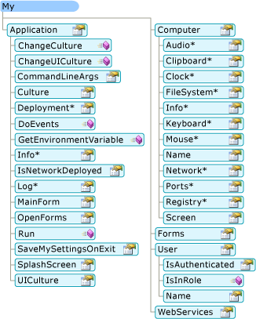
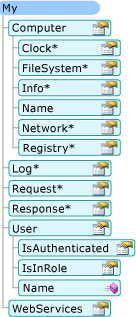

# Зависимость My от типа проекта (Visual Basic)How My Depends on Project Type (Visual Basic)
`My` предоставляет только те объекты, необходимые для конкретного типа проекта.`My` exposes only those objects required by a particular project type. Например `My.Forms` объекта, доступные в приложении Windows Forms, но не доступен в консольном приложении.For example, the `My.Forms` object is available in a Windows Forms application but not available in a console application. В этом разделе описывается, что `My` доступных объектов в различных типах проектов.This topic describes which `My` objects are available in different project types.  
  
## Мои в Windows приложения и веб-сайтовMy in Windows Applications and Web Sites  
 `My` предоставляет только те объекты, которые полезны в текущем типе проекта; он подавляет объекты, которые не применяются.`My` exposes only objects that are useful in the current project type; it suppresses objects that are not applicable. Например, на следующем рисунке показана `My` объектной модели в проекте Windows Forms.For example, the following image shows the `My` object model in a Windows Forms project.  
  
   
  
 В проекте веб-сайта `My` предоставляет объекты, относящиеся к веб-разработчиком (такие как `My.Request` и `My.Response` объектов) при подавлении объекты, которые не являются значимыми (такие как `My.Forms` объекта).In a Web site project, `My` exposes objects that are relevant to a Web developer (such as the `My.Request` and `My.Response` objects) while suppressing objects that are not relevant (such as the `My.Forms` object). На следующем рисунке показана `My` объектной модели в проект веб-сайта:The following image shows the `My` object model in a Web site project:  
  
   
  
## Сведения о проектеProject Details  
 В следующей таблице показаны которой `My` объекты, включенные по умолчанию для восьми типов проектов: Windows приложения, библиотеки типов, консольное приложение, Windows библиотеки элементов управления, Web Библиотека элементов управления, Windows службы, пустым и веб-сайта.The following table shows which `My` objects are enabled by default for eight project types: Windows application, class Library, console application, Windows control library, Web control library, Windows service, empty, and Web site.  
  
 Существуют три версии `My.Application` объект, две версии `My.Computer` объекта и две версии `My.User` объекта; сведения об этих версиях приведены в сноски после таблицы.There are three versions of the `My.Application` object, two versions of the `My.Computer` object, and two versions of `My.User` object; details about these versions are given in the footnotes after the table.  
  
|My-объектMy Object|Приложение WindowsWindows Application|Библиотека классовClass Library|Консольное приложениеConsole Application|Библиотека элементов управления WindowsWindows Control Library|Библиотека веб-элементов управленияWeb Control Library|Служба WindowsWindows Service|EmptyEmpty|Веб-сайтWeb Site|  
|---|---|---|---|---|---|---|---|---|  
|`My.Application`|**Да** 1**Yes** 1|**Да** 2**Yes** 2|**Да** 3**Yes** 3|**Да** 2**Yes** 2|НетNo|**Да** 3**Yes** 3|НетNo|НетNo|  
|`My.Computer`|**Да** 4**Yes** 4|**Да** 4**Yes** 4|**Да** 4**Yes** 4|**Да** 4**Yes** 4|**Да** 5**Yes** 5|**Да** 4**Yes** 4|НетNo|**Да** 5**Yes** 5|  
|`My.Forms`|**Да****Yes**|НетNo|НетNo|**Да****Yes**|НетNo|НетNo|НетNo|НетNo|  
|`My.Log`|НетNo|НетNo|НетNo|НетNo|НетNo|НетNo|НетNo|**Да****Yes**|  
|`My.Request`|НетNo|НетNo|НетNo|НетNo|НетNo|НетNo|НетNo|**Да****Yes**|  
|`My.Resources`|**Да****Yes**|**Да****Yes**|**Да****Yes**|**Да****Yes**|**Да****Yes**|**Да****Yes**|НетNo|НетNo|  
|`My.Response`|НетNo|НетNo|НетNo|НетNo|НетNo|НетNo|НетNo|**Да****Yes**|  
|`My.Settings`|**Да****Yes**|**Да****Yes**|**Да****Yes**|**Да****Yes**|**Да****Yes**|**Да****Yes**|НетNo|НетNo|  
|`My.User`|**Да** 6**Yes** 6|**Да** 6**Yes** 6|**Да** 6**Yes** 6|**Да** 6**Yes** 6|**Да** 7**Yes** 7|**Да** 6**Yes** 6|НетNo|**Да** 7**Yes** 7|  
|`My.WebServices`|**Да****Yes**|**Да****Yes**|**Да****Yes**|**Да****Yes**|**Да****Yes**|**Да****Yes**|НетNo|НетNo|  
  
 1 версию Windows Forms `My.Application`.1 Windows Forms version of `My.Application`. Является производной от версии консоли (см. Примечание 3). Добавляет поддержку для взаимодействия с окнами приложения и предоставляет модель приложения Visual Basic.Derives from the console version (see Note 3); adds support for interacting with the application's windows and provides the Visual Basic Application model.  
  
 2 версии библиотеки `My.Application`.2 Library version of `My.Application`. Предоставляет базовые функциональные возможности, необходимые приложению: содержит элементы для записи в журнал приложений и доступом к данным приложения.Provides the basic functionality needed by an application: provides members for writing to the application log and accessing application information.  
  
 3 версию консоли `My.Application`.3 Console version of `My.Application`. Является производным от версии библиотеки (см. Примечание 2), и добавляет дополнительные элементы для доступа к аргументы командной строки и сведения о развертывании ClickOnce для приложения.Derives from the library version (see Note 2), and adds additional members for accessing the application's command-line arguments and ClickOnce deployment information.  
  
 4 версия Windows `My.Computer`.4 Windows version of `My.Computer`. Является производным от версии сервера (см. Примечание 5) и предоставляет доступ к полезным объектам на клиентском компьютере, например экрана, клавиатуры и мыши.Derives from the Server version (see Note 5), and provides access to useful objects on a client machine, such as the keyboard, screen, and mouse.  
  
 5 серверной версии `My.Computer`.5 Server version of `My.Computer`. Основные сведения о компьютере, такие как имя, доступ к времени и т. д.Provides basic information about the computer, such as the name, access to the clock, and so on.  
  
 6 версия Windows `My.User`.6 Windows version of `My.User`. Этот объект связан с идентификатором текущего потока.This object is associated with the thread's current identity.  
  
 7 веб-версия `My.User`.7 Web version of `My.User`. Этот объект связан с удостоверением пользователя текущего HTTP-запроса приложения.This object is associated with the user identity of the application's current HTTP request.  
  
## См. такжеSee Also  
 <xref:Microsoft.VisualBasic.ApplicationServices.ApplicationBase>  
 <xref:Microsoft.VisualBasic.Devices.Computer>  
 <xref:Microsoft.VisualBasic.Logging.Log>  
 <xref:Microsoft.VisualBasic.ApplicationServices.User>  
 [Настройка доступа к объектам через MyCustomizing Which Objects are Available in My](../../../visual-basic/developing-apps/customizing-extending-my/customizing-which-objects-are-available-in-my.md)  
 [Условная компиляцияConditional Compilation](../../../visual-basic/programming-guide/program-structure/conditional-compilation.md)  
 [/ define (Visual Basic)/define (Visual Basic)](../../../visual-basic/reference/command-line-compiler/define.md)  
 [Объект My.FormsMy.Forms Object](../../../visual-basic/language-reference/objects/my-forms-object.md)  
 [Объект My.RequestMy.Request Object](../../../visual-basic/language-reference/objects/my-request-object.md)  
 [Объект My.ResponseMy.Response Object](../../../visual-basic/language-reference/objects/my-response-object.md)  
 [Объект My.WebServicesMy.WebServices Object](../../../visual-basic/language-reference/objects/my-webservices-object.md)
