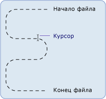

# Основы файлового ввода-вывода и файловой системы в .NET Framework (Visual Basic)
Классы в пространстве имен <xref:System.IO> используются для работы с дисками, файлами и каталогами.  
  
 Пространство имен <xref:System.IO> содержит классы <xref:System.IO.File> и <xref:System.IO.Directory>, обеспечивающие функциональные возможности [!INCLUDE[dnprdnshort](~/includes/dnprdnshort-md.md)] для работы с файлами и каталогами. Поскольку методы этих объектов являются статическими или общими элементами, их можно использовать непосредственно, без предварительного создания экземпляра класса. С этими классами связаны классы <xref:System.IO.FileInfo> и <xref:System.IO.DirectoryInfo>, которые будут знакомы пользователям функции `My`. Чтобы использовать эти классы, необходимо полностью уточнить имена или импортировать подходящие пространства имен, включив операторы `Imports` в начало соответствующего кода. Дополнительные сведения см. в статье [Оператор Imports (пространство имен .NET и тип)](../../../../visual-basic/language-reference/statements/imports-statement-net-namespace-and-type.md).  
  
> [!NOTE]
>  В других подразделах этого раздела для работы с дисками, файлами и каталогами вместо класса `My.Computer.FileSystem` используется объект `System.IO`. Объект `My.Computer.FileSystem` предназначен главным образом для использования в программах [!INCLUDE[vbprvb](~/includes/vbprvb-md.md)]. Классы `System.IO` предназначены для использования в любом языке, который поддерживает [!INCLUDE[dnprdnshort](~/includes/dnprdnshort-md.md)], в том числе [!INCLUDE[vbprvb](~/includes/vbprvb-md.md)].  
  
## Определение потока  
 [!INCLUDE[dnprdnshort](~/includes/dnprdnshort-md.md)] использует потоки для поддержки чтения и записи файлов. Поток можно представить в виде одномерного набора связанных данных, у которого есть начало и конец, где курсор указывает текущее положение в потоке.  
  
   
  
## Потоковые операции  
 Данные, содержащиеся в потоке, могут поступать из памяти, файла или сокета TCP/IP. Потоки имеют основные операции, которые могут быть применены к ним:  
  
-   Чтение. Вы можете выполнять чтение из потока, передавая данные в структуру данных, например строку или массив байтов.  
  
-   **Запись**. Вы можете выполнять запись в поток, передавая данные из источника данных в поток.  
  
-   **Поиск**. Вы можете запрашивать и изменять положение в потоке.  
  
 Для получения дополнительной информации см. [Composing Streams](../../../../../docs/standard/io/composing-streams.md).  
  
## Типы потоков  
 В [!INCLUDE[dnprdnshort](~/includes/dnprdnshort-md.md)] поток представлен классом <xref:System.IO.Stream>, который образует абстрактный класс для всех других потоков. Невозможно непосредственно создать экземпляр класса <xref:System.IO.Stream>, но необходимо использовать один из реализуемых им классов.  
  
 Существует много типов потоков, но при работе с файлами ввода-вывода наиболее важными типами являются класс <xref:System.IO.FileStream>, который предоставляет способ чтения и записи файлов, и класс <xref:System.IO.IsolatedStorage.IsolatedStorageFileStream>, который предоставляет способ создания файлов и каталогов в изолированном хранилище. К другим потокам, которые можно использовать при работе с файловым вводом-выводом, относятся следующие:  
  
-   <xref:System.IO.BufferedStream>  
  
-   <xref:System.Security.Cryptography.CryptoStream>  
  
-   <xref:System.IO.MemoryStream>  
  
-   <xref:System.Net.Sockets.NetworkStream>.  
  
 В следующей таблице перечислены типичные задачи, выполняемые с помощью потока:  
  
|Задача|См. статью|
|---|---|   
|Чтение и запись файла данных|[Практическое руководство. Считывание из нового файла данных и запись в этот файл](../../../../../docs/standard/io/how-to-read-and-write-to-a-newly-created-data-file.md)|  
|Чтение текста из файла|[Практическое руководство. Считывание текста из файла](../../../../../docs/standard/io/how-to-read-text-from-a-file.md)|  
|Запись текста в файл|[Практическое руководство. Запись текста в файл](../../../../../docs/standard/io/how-to-write-text-to-a-file.md)|  
|Считывание символов из строки|[Практическое руководство. Считывание символов из строки](../../../../../docs/standard/io/how-to-read-characters-from-a-string.md)|  
|Запись символов в строку|[Практическое руководство. Запись символов в строку](../../../../../docs/standard/io/how-to-write-characters-to-a-string.md)|  
|Шифрование данных|[Шифрование данных](../../../../../docs/standard/security/encrypting-data.md)|  
|Расшифровка данных|[Расшифровка данных](../../../../../docs/standard/security/decrypting-data.md)|  
  
## Доступ к файлам и атрибуты  
 Вы можете управлять созданием, открытием файлов и их совместным использованием с перечислениями <xref:System.IO.FileAccess>, <xref:System.IO.FileMode> и <xref:System.IO.FileShare>, которые содержат флаги, используемые конструкторами класса <xref:System.IO.FileStream>. Например, когда вы открываете или создаете новый <xref:System.IO.FileStream>, перечисление <xref:System.IO.FileMode> позволяет указать, открывается ли файл для добавления, следует ли создать новый файл, если указанный файл не существует, будет ли перезаписан существующий файл и т. д.  
  
 Перечисление <xref:System.IO.FileAttributes> включает сбор относящихся к файлу сведений. Перечисление <xref:System.IO.FileAttributes> возвращает сохраненные атрибуты файла, например, является ли он сжатым, зашифрованным, скрытым, доступным только для чтения, архивом, каталогом, системным файлом или временным файлом.  
  
 В следующей таблице перечислены задачи, касающиеся доступа к файлам и атрибутов файлов:  
  
|Целевой тип|См.|  
|---|---|
|Открытие файла журнала и добавление в него текста|[Практическое руководство. Открытие файла журнала и добавление в него данных](../../../../../docs/standard/io/how-to-open-and-append-to-a-log-file.md)|  
|Определение атрибутов файла|<xref:System.IO.FileAttributes>|  
  
## Разрешения файла  
 Доступом к файлам и каталогам можно управлять с помощью класса <xref:System.Security.Permissions.FileIOPermission>. Это может быть особенно важно для разработчиков, работающих с веб-формами, которые по умолчанию выполняются в контексте специальной локальной учетной записи пользователя ASP.NET, создаваемой в рамках установок [!INCLUDE[vstecasp](~/includes/vstecasp-md.md)] и [!INCLUDE[dnprdnshort](~/includes/dnprdnshort-md.md)]. Когда такое приложение запрашивает доступ к ресурсу, учетная запись пользователя ASP.NET имеет ограниченные разрешения, что может помешать пользователю выполнять действия, такие как запись в файл из веб-приложения. Дополнительные сведения см. в статьях [о разрешениях безопасности](http://msdn.microsoft.com/en-us/b03757b4-e926-4196-b738-3733ced2bda0) и <xref:System.Security.Permissions.FileIOPermission>.  
  
## Изолированное хранилище файлов  
 Изолированное хранилище — это попытка устранить проблемы, которые могут возникать, если при работе с файлами у пользователя или кода отсутствуют необходимые разрешения. Изолированное хранилище назначает каждому пользователю секцию данных, которая может содержать одно или несколько хранилищ. Хранилища могут изолироваться друг от друга по пользователю или по сборке. Доступ к хранилищу имеет только пользователь и сборка, которые его создали. Хранилище действует в качестве полноценной виртуальной файловой системы — в пределах одного хранилища можно создавать и использовать каталоги и файлы.  
  
 В следующей таблице перечислены типичные задачи, связанные с изолированным хранилищем файлов.  
  
|Задача|См. статью|
|---|---|  
|Создание изолированного хранилища|[Практическое руководство. Получение хранилищ для изолированного хранения](../../../../../docs/standard/io/how-to-obtain-stores-for-isolated-storage.md)|  
|Перечисление изолированных хранилищ|[Практическое руководство. Перечисление хранилищ для изолированного хранилища](../../../../../docs/standard/io/how-to-enumerate-stores-for-isolated-storage.md)|  
|Удаление изолированного хранилища|[Практическое руководство. Удаление хранилищ из области изолированного хранения](../../../../../docs/standard/io/how-to-delete-stores-in-isolated-storage.md)|  
|Создание файла или каталога в изолированном хранилище|[Практическое руководство. Создание файлов и каталогов в изолированном хранилище](../../../../../docs/standard/io/how-to-create-files-and-directories-in-isolated-storage.md)|  
|Поиск файла в изолированном хранилище|[Практическое руководство. Поиск существующих файлов и каталогов в изолированном хранилище](../../../../../docs/standard/io/how-to-find-existing-files-and-directories-in-isolated-storage.md)|  
|Чтение или запись файла в изолированном хранилище|[Практическое руководство. Считывание из файлов и запись в файлы в изолированном хранилище](../../../../../docs/standard/io/how-to-read-and-write-to-files-in-isolated-storage.md)|  
|Удаление файла или каталога в изолированном хранилище|[Практическое руководство. Удаление файлов и каталогов из изолированного хранилища](../../../../../docs/standard/io/how-to-delete-files-and-directories-in-isolated-storage.md)|  
  
## События файлов  
 Компонент <xref:System.IO.FileSystemWatcher> позволяет наблюдать за изменениями в файлах и каталогах в локальной системе или на любом компьютере, к которому имеется доступ по сети. Например, при изменении файла можно отправить пользователю соответствующее оповещение. При внесении изменений выдается одно или несколько событий, которые сохраняются в буфере и передаются в компонент <xref:System.IO.FileSystemWatcher> для обработки.  
  
## См. также  
 [Составление потоков](../../../../../docs/standard/io/composing-streams.md)  
 [Файловый и потоковый ввод-вывод](https://msdn.microsoft.com/library/k3352a4t)  
 [Асинхронный файловый ввод-вывод](https://msdn.microsoft.com/library/kztecsys)  
 [Классы, используемые при файловом вводе-выводе в .NET Framework, и файловая система (Visual Basic)](../../../../visual-basic/developing-apps/programming/drives-directories-files/classes-used-in-net-framework-file-io-and-the-file-system.md)
