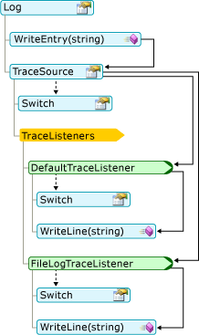
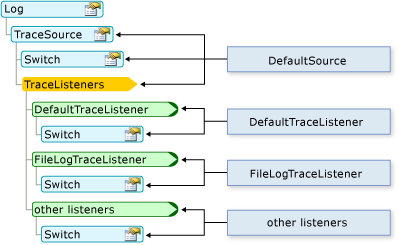

# Работа с журналами приложения в Visual Basic
[!INCLUDE[vs2017banner](../../../../csharp/includes/vs2017banner.md)]

Объекты `My.Applicaton.Log` и `My.Log` упрощают запись сообщений и данных трассировки в журналы.  
  
## Как осуществляется регистрация сообщений  
 Сначала проверяется уровень серьезности сообщения с помощью свойства <xref:System.Diagnostics.TraceSource.Switch%2A> свойства журнала <xref:Microsoft.VisualBasic.Logging.Log.TraceSource%2A>. По умолчанию только сообщения с уровнем серьезности "Информация" и более высоким передаются прослушивателям трассировки, определенным в коллекции `TraceListener` журнала. Затем каждый прослушиватель сравнивает серьезность сообщения со свойством <xref:System.Diagnostics.TraceSource.Switch%2A> прослушивателя. Если уровень серьезности сообщения достаточно высокий, прослушиватель записывает сообщение.  
  
 На приведенной ниже схеме показан способ передачи сообщения, записанного методом `WriteEntry`, в методы `WriteLine` прослушивателей трассировки журнала.  
  
   
  
 Поведение журнала и прослушивателей трассировки можно изменить путем изменения файла конфигурации приложения. На приведенной ниже схеме показано соответствие между элементами журнала и файла конфигурации.  
  
   
  
## Куда записываются сообщения  
 Если сборка не имеет файла конфигурации, объекты `My.Application.Log` и `My.Log` записывают сообщения в вывод отладки приложения \(с использованием класса <xref:System.Diagnostics.DefaultTraceListener>\). Кроме того, объект `My.Application.Log` записывает сообщения в файл журнала сборки \(с использованием класса <xref:Microsoft.VisualBasic.Logging.FileLogTraceListener>\), а объект `My.Log` записывает сообщения в вывод веб\-страницы ASP.NET \(с использованием класса <xref:System.Web.WebPageTraceListener>\).  
  
 При работе с приложением в режиме отладки вывод отладки можно просматривать в окне **Вывод**[!INCLUDE[vsprvs](../../../../csharp/includes/vsprvs_md.md)]. Чтобы открыть окно **Вывод**, выберите пункт меню **Отладка**, наведите указатель на пункт **Окна** и выберите пункт **Вывод**. В окне **Вывод** выберите значение **Отладка** в поле **Показать выходные данные из**.  
  
 По умолчанию объект `My.Application.Log` записывает сообщения в файл журнала, расположенный по пути данных приложения пользователя. Путь можно получить из свойства <xref:Microsoft.VisualBasic.Logging.FileLogTraceListener.FullLogFileName%2A> объекта <xref:Microsoft.VisualBasic.Logging.Log.DefaultFileLogWriter%2A>. Путь имеет следующий формат:  
  
 `BasePath`\\`CompanyName`\\`ProductName`\\`ProductVersion`  
  
 Стандартное значение для `BasePath` будет следующим.  
  
 C:\\Documents and Settings\\`username`\\Application Data  
  
 Значения параметров `CompanyName`, `ProductName` и `ProductVersion` берутся из сведений о сборке приложения. Имя файла журнала имеет следующий формат: *AssemblyName*.log, где *AssemblyName* — имя файла сборки без расширения. Если требуется несколько файлов журнала, например, когда исходный журнал недоступен при попытке записи в журнал, имя файла журнала имеет следующий формат: *AssemblyName*\-*iteration*.log, где `iteration` — положительное целое число типа `Integer`.  
  
 Поведение по умолчанию можно переопределить путем добавления или изменения файлов конфигурации компьютера и приложения. Для получения дополнительной информации см. [Пошаговое руководство. Изменение места записи информации для My.Application.Log](../../../../visual-basic/developing-apps/programming/log-info/walkthrough-changing-where-my-application-log-writes-information.md).  
  
## Настройка параметров журнала  
 Реализация объекта `Log` по умолчанию работает без файла конфигурации приложения app.config. Чтобы изменить значения по умолчанию, необходимо добавить файл конфигурации с новыми значениями параметров. Дополнительные сведения см. в разделе [Пошаговое руководство. Фильтрация вывода My.Application.Log](../../../../visual-basic/developing-apps/programming/log-info/walkthrough-filtering-my-application-log-output.md).  
  
 Разделы конфигурации журнала находятся в узле `<system.diagnostics>` в основном узле `<configuration>` файла app.config. Сведения журнала определены в нескольких узлах.  
  
-   Прослушиватели для объекта `Log` определены в узле `<sources>` с именем DefaultSource.  
  
-   Фильтр серьезности для объекта `Log` определен в узле `<switches>` с именем DefaultSwitch.  
  
-   Прослушиватели журнала определены в узле `<sharedListeners>`.  
  
 Примеры узлов `<sources>`, `<switches>` и `<sharedListeners>` показаны в приведенном ниже коде.  
  
```  
<configuration>  
  <system.diagnostics>  
    <sources>  
      <source name="DefaultSource" switchName="DefaultSwitch">  
        <listeners>  
          <add name="FileLog"/>  
        </listeners>  
      </source>  
    </sources>  
    <switches>  
      <add name="DefaultSwitch" value="Information" />  
    </switches>  
    <sharedListeners>  
      <add name="FileLog"  
        type="Microsoft.VisualBasic.Logging.FileLogTraceListener,  
          Microsoft.VisualBasic, Version=8.0.0.0, Culture=neutral,   
          PublicKeyToken=b03f5f7f11d50a3a, processorArchitecture=MSIL"  
        initializeData="FileLogWriter"  
      />  
    </sharedListeners>  
  </system.diagnostics>  
</configuration>  
```  
  
## Изменение параметров журнала после развертывания  
 При разработке приложения его параметры конфигурации хранятся в файле app.config, как показано в приведенных выше примерах. После развертывания приложения настройку журнала можно по\-прежнему выполнять с помощью файла конфигурации. В приложении Windows этот файл имеет имя *имяПриложения*.exe.config и должен находиться в той же папке, что и исполняемый файл. Для веб\-приложения это файл Web.config, связанный с проектом.  
  
 Когда приложение выполняет код, который впервые создает экземпляр класса, выполняется проверка сведений об объекте в файле конфигурации. Для объекта `Log` это происходит при первом обращении к объекту `Log`. Система проверяет файл конфигурации только один раз для каждого отдельного объекта — при первом создании объекта в приложении. Таким образом, необходимо перезапустить приложение, чтобы изменения вступили в силу.  
  
 В развернутом приложении активация кода трассировки выполняется путем повторной настройки объектов переключателей до запуска приложения. Обычно это подразумевает включение и отключение объектов переключателей или изменение уровней трассировки, а затем перезапуск приложения.  
  
## Вопросы безопасности  
 При записи данных в журнал необходимо учитывать указанные ниже моменты.  
  
-   **Не допускайте утечки сведений о пользователе**. Записывайте в журнал только одобренные сведения. Например, в журнале приложения могут содержаться имена пользователей, но не их пароли.  
  
-   **Храните журнал в безопасном месте**. Любой журнал, который может содержать конфиденциальные данные, должен храниться в безопасном месте.  
  
-   **Не допускайте неправильных сведений**. В общем случае приложение должно проверять все данные, введенные пользователем, перед их использованием. Это относится и к записи данных в журнал приложения.  
  
-   **Не допускайте отказа в обслуживании**. Если приложение записывает в журнал слишком много сведений, это может привести к переполнению журнала или усложнить поиск важной информации.  
  
## См. также  
 <xref:Microsoft.VisualBasic.Logging.Log?displayProperty=fullName>   
 [Запись сведений в журнал из приложения](../../../../visual-basic/developing-apps/programming/log-info/logging-information-from-the-application.md)