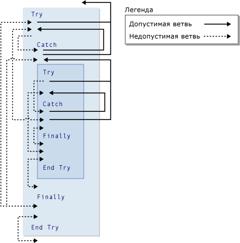

# <a name="goto-statement"></a>Оператор GoTo
Осуществляет безусловный переход на указанную строку в процедуре.  
  
## <a name="syntax"></a>Синтаксис  
  
```  
GoTo line  
```  
  
## <a name="part"></a>Отделение  
 `line`  
 Обязательный. Метка строки.  
  
## <a name="remarks"></a>Примечания  
 `GoTo` Оператор может выполнять переход только к строкам в процедуре, в котором он находится. Строка должна содержать строку, метка `GoTo` могут ссылаться на. Дополнительные сведения см. в разделе [Как Операторы меток](../../../visual-basic/programming-guide/program-structure/how-to-label-statements.md).  
  
> [!NOTE]
>  `GoTo` операторы могут затруднить кода чтение и обслуживание. По возможности используйте структуру управления. Дополнительные сведения см. в разделе [поток управления](../../../visual-basic/programming-guide/language-features/control-flow/index.md).  
  
 Нельзя использовать `GoTo` инструкции для выхода из блоков `For`... `Next`, `For Each`... `Next`, `SyncLock`... `End SyncLock`, `Try`... `Catch`... `Finally`, `With`... `End With`, или `Using`... `End Using` конструкции к метке внутри.  
  
## <a name="branching-and-try-constructions"></a>Конструкции Try и ветвления  
 В рамках `Try`... `Catch`... `Finally` конструкции, применяются следующие правила для ветвления с `GoTo` инструкции.  
  
|Блок или область|Ветвление внутрь извне|Ветвление вовне|  
|---------------------|-------------------------------|-------------------------------|  
|`Try` Блок|Только из `Catch` блок используется одинаковая конструкция <sup>1</sup>|Только за пределами всей конструкции|  
|`Catch` Блок|Никогда не допускается|Только за пределами всей конструкции или `Try` блок используется одинаковая конструкция <sup>1</sup>|  
|`Finally` Блок|Никогда не допускается|Никогда не допускается|  
  
 <sup>1</sup> Если один `Try`... `Catch`... `Finally` вложена в другую, `Catch` можно ветвь для блока `Try` блок в свой собственный уровень вложенности, но не в любых других `Try` блока. Вложенный `Try`... `Catch`... `Finally` конструкции, которые должны содержаться в полностью `Try` или `Catch` блок конструкции, в который он вложен.  
  
 На следующем рисунке показан один `Try` конструкции, вложенным в другое. Различные ветви между блоками двух конструкций обозначены как допустимое или недопустимое.  
  
   
Допустимые и недопустимые ветви в конструкциях Try  
  
## <a name="example"></a>Пример  
 В следующем примере используется `GoTo` инструкция ветви на метки в процедуре.  
  
 [!code-vb[VbVbalrStatements#31](../../../visual-basic/language-reference/error-messages/codesnippet/VisualBasic/goto-statement_1.vb)]  
  
## <a name="see-also"></a>См. также
- [Оператор Do...Loop](../../../visual-basic/language-reference/statements/do-loop-statement.md)
- [Оператор For...Next](../../../visual-basic/language-reference/statements/for-next-statement.md)
- [Оператор For Each...Next](../../../visual-basic/language-reference/statements/for-each-next-statement.md)
- [Оператор If...Then...Else](../../../visual-basic/language-reference/statements/if-then-else-statement.md)
- [Оператор Select...Case](../../../visual-basic/language-reference/statements/select-case-statement.md)
- [Оператор Try...Catch...Finally](../../../visual-basic/language-reference/statements/try-catch-finally-statement.md)
- [Оператор While...End While](../../../visual-basic/language-reference/statements/while-end-while-statement.md)
- [Оператор With...End With](../../../visual-basic/language-reference/statements/with-end-with-statement.md)
