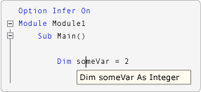

# Option Infer - оператор
[!INCLUDE[vs2017banner](../../../visual-basic/includes/vs2017banner.md)]

Включает использование локального определения типов при объявлении переменных.  
  
## Синтаксис  
  
```  
Option Infer { On | Off }  
```  
  
## Части  
  
|||  
|-|-|  
|Термин|Определение|  
|`On`|Необязательно.  Включает локальное определение типов.|  
|`Off`|Необязательно.  Отключает локальное определение типов.|  
  
## Заметки  
 Чтобы задать `Option Infer` в файле, введите `Option Infer On` или `Option Infer Off` в начале файла перед всем остальным исходным кодом.  Если значение, заданное для `Option Infer` в файле, конфликтует со значением, заданным в среде разработки или в командной строке, приоритет имеет значение в файле.  
  
 Если задать для `Option Infer` значение `On`, можно объявлять локальные переменные, не задавая явным образом тип данных.  Компилятор определяет тип переменной по типу ее выражения инициализации.  
  
 На следующей иллюстрации `Option Infer` включен.  Переменная в объявлении `Dim someVar = 2` объявляется как целочисленная определением типов.  
  
   
IntelliSense при включенном параметре Option Infer  
  
 На следующей иллюстрации `Option Infer` отключен.  Переменная в объявлении `Dim someVar = 2` объявляется как `Object` определением типов.  В этом примере для параметра **Option Strict** задано значение **Выкл.** в [Страница "Компиляция" в конструкторе проектов \(Visual Basic\)](/visual-studio/ide/reference/compile-page-project-designer-visual-basic).  
  
   
IntelliSense при отключенном параметре Option Infer  
  
> [!NOTE]
>  Если переменная объявлена как `Object`, тип времени выполнения может измениться в ходе работы программы.  [!INCLUDE[vbprvb](../../../csharp/programming-guide/concepts/linq/includes/vbprvb-md.md)] выполняет операции *упаковки* и *распаковки* для преобразования между `Object` и типом значения, что замедляет выполнение.  Сведения о упаковке и распаковке см. в разделе [Спецификация языка Visual Basic](../../../visual-basic/reference/language-specification.md).  
  
 Определение типов применяется на уровне процедур и не применяется вне процедур в классах, структурах, модулях и интерфейсах.  
  
 Дополнительные сведения см. в разделе [Вывод локального типа](../../../visual-basic/programming-guide/language-features/variables/local-type-inference.md).  
  
## Если оператор Option Infer отсутствует  
 Если исходный код не содержит оператор `Option Infer`, то используется параметр **Option Infer** в [Страница "Компиляция" в конструкторе проектов \(Visual Basic\)](/visual-studio/ide/reference/compile-page-project-designer-visual-basic).  Если используется компилятор командной строки, используется параметр компилятора [\/optioninfer](../../../visual-basic/reference/command-line-compiler/optioninfer.md).  
  
#### Чтобы включить Option Infer в среде разработки  
  
1.  Выберите проект в **обозревателе решений**.  В меню **Проект** выберите пункт **Свойства**.  Для получения дополнительной информации см. [NIB: Managing Project Properties with the Project Designer](http://msdn.microsoft.com/ru-ru/983f3c18-832f-4666-afec-74b716ff3e0e).  
  
2.  Откройте вкладку **Компиляция**.  
  
3.  Задайте значение в поле **Option infer**.  
  
 При создании нового проекта значение параметра **Option Infer** на вкладке **Компиляция** задается в соответствии со значением параметра **Option Infer** в диалоговом окне **Параметры Visual Basic по умолчанию**.  Чтобы открыть диалоговое окно **Параметры Visual Basic по умолчанию**, в меню **Сервис** щелкните **Настройки**.  В диалоговом окне **Настройки** разверните **Проекты и решения**, затем щелкните **Параметры Visual Basic по умолчанию**.  Начальный параметр по умолчанию в **Параметры Visual Basic по умолчанию** — `On`.  
  
#### Чтобы включить Option Infer в командной строке  
  
-   Включите параметр компилятора [\/optioninfer](../../../visual-basic/reference/command-line-compiler/optioninfer.md) в команде **vbc**.  
  
## Типы данных и значения по умолчанию  
 В следующей таблице перечислены результаты различных сочетаний заданных типов данных и инициализаторов в операторе `Dim`.  
  
|||||  
|-|-|-|-|  
|Указан тип данных?|Указан инициализатор?|Пример|Результат|  
|Нет|Нет|`Dim qty`|Если `Option Strict` отключен \(по умолчанию\), для переменной устанавливается значение `Nothing`.<br /><br /> Если параметр `Option Strict` включен, при компиляции возникает ошибка.|  
|Нет|Да|`Dim qty = 5`|Если параметр `Option Infer` включен \(по умолчанию\), переменная получает тип данных инициализатора.  См. раздел [Вывод локального типа](../../../visual-basic/programming-guide/language-features/variables/local-type-inference.md).<br /><br /> Если параметры `Option Infer` и `Option Strict` отключены, переменная получает тип данных `Object`.<br /><br /> Если параметр `Option Infer` отключен, а параметр `Option Strict` включен, при компиляции возникает ошибка.|  
|Да|Нет|`Dim qty As Integer`|Переменная инициализируется со значением по умолчанию для типа данных.  Для получения дополнительной информации см. [Оператор Dim](../../../visual-basic/language-reference/statements/dim-statement.md).|  
|Да|Да|`Dim qty  As Integer = 5`|Если тип данных инициализатора нельзя преобразовать в указанный тип данных, при компиляции возникает ошибка.|  
  
## Пример  
 В следующих примерах показано, как оператор `Option Infer` включает локальное определение типов.  
  
 [!code-vb[VbVbalrTypeInference#6](../../../visual-basic/language-reference/statements/codesnippet/VisualBasic/option-infer-statement_1.vb)]  
  
## Пример  
 В следующем примере показано, что тип времени выполнения может различаться, когда переменная указана как `Object`.  
  
 [!code-vb[VbVbalrTypeInference#11](../../../visual-basic/language-reference/statements/codesnippet/VisualBasic/option-infer-statement_2.vb)]  
  
## См. также  
 [Оператор Dim](../../../visual-basic/language-reference/statements/dim-statement.md)   
 [Вывод локального типа](../../../visual-basic/programming-guide/language-features/variables/local-type-inference.md)   
 [Оператор Option Compare](../../../visual-basic/language-reference/statements/option-compare-statement.md)   
 [Оператор Option Explicit](../../../visual-basic/language-reference/statements/option-explicit-statement.md)   
 [Оператор Option Strict](../../../visual-basic/language-reference/statements/option-strict-statement.md)   
 [Страница "Параметры Visual Basic по умолчанию", папка "Проекты", диалоговое окно "Параметры"](/visual-studio/ide/reference/visual-basic-defaults-projects-options-dialog-box)   
 [\/optioninfer](../../../visual-basic/reference/command-line-compiler/optioninfer.md)   
 [Упаковка–преобразование и распаковка–преобразование](../../../csharp/programming-guide/types/boxing-and-unboxing.md)