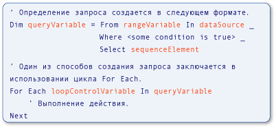

# Type Relationships in Query Operations (Visual Basic)
[!INCLUDE[vs2017banner](../../../../visual-basic/includes/vs2017banner.md)]

Переменные, используемые в операциях запроса [!INCLUDE[vbteclinqext](../../../../csharp/getting-started/includes/vbteclinqext-md.md)], являются строго типизированными и должны быть совместимы друг с другом.  Строгая типизация используется в источнике данных, в самом запросе и при выполнении запроса.  На следующем рисунке показаны термины, используемые для описания запроса [!INCLUDE[vbteclinq](../../../../csharp/includes/vbteclinq-md.md)].  Дополнительные сведения о частях запроса см. в разделе [Основные операции запроса \(Visual Basic\)](../../../../visual-basic/programming-guide/concepts/linq/basic-query-operations.md).  
  
   
Части запроса LINQ  
  
 Тип переменной диапазона в запросе должен быть совместим с типом элементов в источнике данных.  Тип переменной запроса должен быть совместим с последовательностью элемента, определенной в предложении `Select`.  И наконец, тип элементов последовательности также должен быть совместим с типом переменной цикла, которая используется в операторе `For Each`, выполняющем запрос.  Строгая типизация упрощает идентификацию ошибок типов во время компиляции.  
  
 [!INCLUDE[vbprvb](../../../../csharp/programming-guide/concepts/linq/includes/vbprvb-md.md)] делает строгую типизацию удобной за счет реализации локального определения типа, также называемого *неявной типизацией*.  Эта возможность используется в предыдущем примере, и применяется примерах и документации по [!INCLUDE[vbteclinq](../../../../csharp/includes/vbteclinq-md.md)].  В Visual Basic локальное определение типа осуществляется при помощи оператора `Dim` без предложения `As`.  В следующем примере `city` строго типизирован в качестве строки.  
  
 [!code-vb[VbLINQTypeRels#1](../../../../visual-basic/programming-guide/concepts/linq/codesnippet/VisualBasic/type-relationships-in-query-operations_1.vb)]  
  
> [!NOTE]
>  Локальное определение типа работает только тогда, когда `Option Infer` имеет значение `On`.  Дополнительные сведения см. в разделе [Option Infer \- оператор](../../../../visual-basic/language-reference/statements/option-infer-statement.md).  
  
 Однако даже если локальное определение типа используется в запросе, отношение типов между переменными в источнике данных, переменной запрос и переменной цикла, выполняющего запрос, остается неизменным.  При написании запросов [!INCLUDE[vbteclinq](../../../../csharp/includes/vbteclinq-md.md)] или работе с примерами кода в документации знание отношений типов является полезным моментом.  
  
 Возможно, потребуется указать явный тип переменной диапазона, который не соответствует типу, возвращенному из источника данных.  Тип переменной диапазона можно указать с помощью ключевого слова `As`.  Однако это приведет к ошибке, если преобразование является [сужающим](../../../../visual-basic/programming-guide/language-features/data-types/widening-and-narrowing-conversions.md), а параметр `Option Strict` имеет значение `On`.  Поэтому рекомендуется применять преобразование к значениям, получаемым из источника данных.  Значения из источника данных можно преобразовать к явно заданному типу переменной диапазона с помощью метода <xref:System.Linq.Enumerable.Cast%2A>.  Кроме того, можно приводить значения, выбранные в предложении `Select`, к явному типу, отличающемуся от типа переменной диапазона.  Эти варианты демонстрируются в следующем коде.  
  
 [!code-vb[VbLINQTypeRels#4](../../../../visual-basic/programming-guide/concepts/linq/codesnippet/VisualBasic/type-relationships-in-query-operations_2.vb)]  
  
## Запросы, которые возвращают целые элементы из источника данных  
 В следующем примере показана операция запроса [!INCLUDE[vbteclinq](../../../../csharp/includes/vbteclinq-md.md)], возвращающая последовательность элементов, выбранных из источника данных.  Источник `names` содержит массив строк, а результат запроса представляет собой последовательность, содержащую строки, которые начинаются с буквы М.  
  
 [!code-vb[VbLINQTypeRels#2](../../../../visual-basic/programming-guide/concepts/linq/codesnippet/VisualBasic/type-relationships-in-query-operations_3.vb)]  
  
 Это аналогично следующему коду, но намного короче и проще в написании.  Использование локального определения типов в запросах является предпочтительным для Visual Basic.  
  
 [!code-vb[VbLINQTypeRels#3](../../../../visual-basic/programming-guide/concepts/linq/codesnippet/VisualBasic/type-relationships-in-query-operations_4.vb)]  
  
 Следующие отношения существуют в обоих предыдущих примерах кода независимо от способа определения типа — явного или неявного.  
  
1.  Тип элементов в источнике данных — `names` — является типом переменной диапазона — `name` — в запросе.  
  
2.  Тип объекта, который выбран, `name`, определяет тип переменной запроса `mNames`.  Здесь `name` является строкой, поэтому переменная запроса имеет тип IEnumerable\(Of String\) в Visual Basic.  
  
3.  Запрос, определенный в `mNames`, выполняется в цикле `For Each`.  Цикл выполняет итерацию результата выполнения запроса.  Поскольку `mNames` при выполнении вернет последовательность строк, переменная итерации цикла `nm` также является строкой.  
  
## Запросы, возвращающие одно поле из выбранных элементов  
 В следующем примере показана операция запроса [!INCLUDE[vbtecdlinq](../../../../csharp/includes/vbtecdlinq-md.md)], которая возвращает последовательность, содержащую только одну часть каждого элемента, выбранного из источника данных.  Запрос получает коллекцию объектов `Customer` в качестве источника данных, а в результате проецирует только свойство `Name`.  Поскольку имя заказчика является строкой, запрос создает последовательность строк в качестве выходных данных.  
  
<CodeContentPlaceHolder>0</CodeContentPlaceHolder>  
 Отношения между переменными такие же, как и в более простых примерах.  
  
1.  Тип элементов в источнике данных, `customers`, всегда является типом переменной диапазона, `cust`, в запросе.  В этом примере этот тип является `Customer`.  
  
2.  Оператор `Select` возвращает свойство `Name` каждого объекта вместо целого объекта `Customer`.  Поскольку `Name` является строкой, переменная запроса `custNames` снова будет иметь тип IEnumerable\(Of String\), а не `Customer`.  
  
3.  Поскольку `custNames` представляет собой последовательность строк, переменная итерации цикла `For Each`, `custName` должна быть строкой.  
  
 Без локального определения типа предыдущий пример был бы более громоздким для записи и понимания, как показано в следующем примере.  
  
<CodeContentPlaceHolder>1</CodeContentPlaceHolder>  
## Запросы, требующие анонимные типы  
 В следующем примере показана более сложная ситуация.  В предыдущем примере явное указание типов для всех переменных было неудобным.  В данном примере это невозможно.  В отличие от выбора полных элементов `Customer` из источника данных или одного поля из каждого элемента, предложение `Select` в этом запросе возвращает два свойства из исходного объекта `Customer`: `Name` и `City`.  В ответ на предложение `Select` компилятор определяет анонимный тип, содержащий эти два свойства.  Результатом выполнения `nameCityQuery` в цикле `For Each` является коллекция экземпляров нового анонимного типа.  Поскольку анонимный тип не имеет имени, нельзя указать тип для `nameCityQuery` или `custInfo` явным образом.  Это значит, что при наличии анонимного типа отсутствует имя типа, которое можно использовать вместо `String` в `IEnumerable(Of String)`.  Дополнительные сведения см. в разделе [Анонимные типы](../../../../visual-basic/programming-guide/language-features/objects-and-classes/anonymous-types.md).  
  
<CodeContentPlaceHolder>2</CodeContentPlaceHolder>  
 Хотя указать типы для всех переменных в предыдущем примере невозможно, отношения между ними остаются неизменными.  
  
1.  Тип элементов в источнике данных является типом переменной диапазона в запросе.  В этом примере `cust` представляет собой экземпляр `Customer`.  
  
2.  Так как оператор `Select` создает анонимный тип, переменная запроса `nameCityQuery` должна быть неявно типизирована в качестве анонимного типа.  Анонимный тип не имеет имени и поэтому не может быть указан явно.  
  
3.  Типом переменной перебора в цикле `For Each` является анонимный тип, созданный на шаге 2.  Поскольку у типа нет пригодного для использования имени, тип переменной перебора цикла следует определять неявно.  
  
## См. также  
 [Getting Started with LINQ in Visual Basic](../../../../visual-basic/programming-guide/concepts/linq/getting-started-with-linq.md)   
 [Анонимные типы](../../../../visual-basic/programming-guide/language-features/objects-and-classes/anonymous-types.md)   
 [Вывод локального типа](../../../../visual-basic/programming-guide/language-features/variables/local-type-inference.md)   
 [Знакомство с LINQ в Visual Basic](../../../../visual-basic/programming-guide/language-features/linq/introduction-to-linq.md)   
 [LINQ](../../../../visual-basic/programming-guide/language-features/linq/index.md)   
 [Запросы](../../../../visual-basic/language-reference/queries/queries.md)