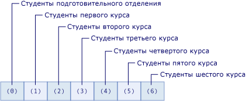

# Массивы в Visual Basic
[!INCLUDE[vs2017banner](../../../../visual-basic/includes/vs2017banner.md)]

Массив — это набор значений, логически связанных друг с другом, например число учеников в каждом классе школы.  Если вам нужна справка по массивам в Visual Basic для приложений \(VBA\), см. [справочник по языку](https://msdn.microsoft.com/en-us/library/office/gg264383\(v=office.14\).aspx).  
  
 С помощью массива можно ссылаться на эти связанные значения по одному имени и использовать номер, называемый индексом, чтобы отличать элементы друг от друга. Отдельные значения называются элементами массива. Они составляют непрерывную последовательность от индекса 0 до наибольшего значения индекса.  
  
 В отличие от массива, переменная, содержащая одиночное значение, называется *скалярной* переменной.  
  
 Несколько простых примеров перед подробным описанием:  
  
```vb  
  
'Declare a single-dimension array of 5 values Dim numbers(4) As Integer ‘Declare a single-dimension array and set array element values Dim numbers = New Integer() {1, 2, 4, 8} ‘Redefine the size of an existing array retaining the current values ReDim Preserve numbers(15) ‘Redefine the size of an existing array, resetting the values ReDim numbers(15) ‘Declare a multi-dimensional array Dim matrix(5, 5) As Double ‘Declare a multi-dimensional array and set array element values Dim matrix = New Integer(4, 4) {{1, 2}, {3, 4}, {5, 6}, {7, 8}} ‘Declare a jagged array Dim sales()() As Double = New Double(11)() {}  
```  
  
 **Содержание раздела**  
  
-   [Элементы простого массива](#BKMK_ArrayElements)  
  
-   [Создание массива](#BKMK_CreatingAnArray)  
  
-   [Сохранение значений в массиве](#BKMK_StoringValues)  
  
-   [Заполнение массива начальными значениями](#BKMK_Populating)  
  
    -   [Вложенные литералы массива](#BKMK_NestedArrayLiterals)  
  
-   [Перебор массива](#BKMK_Iterating)  
  
-   [Массивы как возвращаемые значения и параметры](#BKMK_ReturnValues)  
  
-   [Массивы массивов](#BKMK_JaggedArrays)  
  
-   [Массивы нулевой длины](#BKMK_ZeroLength)  
  
-   [Размер массива](#BKMK_ArraySize)  
  
-   [Типы массивов и другие типы](#BKMK_ArrayTypes)  
  
-   [Коллекции как альтернатива массивам](#BKMK_Collections)  
  
##  <a name="BKMK_ArrayElements"></a> Элементы простого массива  
 В приведенном ниже примере объявляется переменная массива для хранения числа учеников в каждом классе школы.  
  
 [!code-vb[VbVbalrArrays#2](../../../../visual-basic/programming-guide/language-features/arrays/codesnippet/visualbasic/index_1.vb)]  
  
 Массив `students` в предыдущем примере содержит 7 элементов. Индексы элементов находятся в диапазоне от 0 до 6. Использовать массив проще, чем объявлять семь отдельных переменных.  
  
 На рисунке ниже показан массив `students`. Для каждого элемента массива:  
  
-   индекс элемента представляет школьный класс \(индекс 0 представляет детский сад\);  
  
-   значение, содержащееся в элементе, представляет число учеников в этом классе.  
  
   
Элементы массива students  
  
 В приведенном ниже примере показано обращение к первому, второму и последнему элементам массива `students`.  
  
 [!code-vb[VbVbalrArrays#3](../../../../visual-basic/programming-guide/language-features/arrays/codesnippet/visualbasic/index_2.vb)]  
  
 Можно ссылаться на массив в целом, используя только имя переменной массива без индексов.  
  
 Массив `students` в предыдущем примере имеет один индекс и считается одномерным. Массив, имеющий более одного индекса, называется многомерным. Дополнительные сведения см. далее в этом разделе и в разделе [Размерность массивов в Visual Basic](../../../../visual-basic/programming-guide/language-features/arrays/array-dimensions.md).  
  
##  <a name="BKMK_CreatingAnArray"></a> Создание массива  
 Размер массива можно задать несколькими способами. Можно указать размер при объявлении массива, как показано в примере ниже.  
  
 [!code-vb[VbVbalrArrays#12](../../../../visual-basic/programming-guide/language-features/arrays/codesnippet/visualbasic/index_3.vb)]  
  
 Кроме того, можно указать размер массива при его создании с помощью предложения `New`, как показано в примере ниже.  
  
 [!code-vb[VbVbalrArrays#11](../../../../visual-basic/programming-guide/language-features/arrays/codesnippet/visualbasic/index_4.vb)]  
  
 Если массив уже существует, его размер можно переопределить с помощью оператора `Redim`. Можно указать, что оператор `Redim` должен сохранить значения, уже имеющиеся в массиве, или создать пустой массив. В приведенном ниже примере показаны различные варианты использования оператора `Redim` для изменения размера существующего массива.  
  
 [!code-vb[VbVbalrArrays#13](../../../../visual-basic/programming-guide/language-features/arrays/codesnippet/visualbasic/index_5.vb)]  
  
 Для получения дополнительной информации см. [Оператор ReDim](../../../../visual-basic/language-reference/statements/redim-statement.md).  
  
##  <a name="BKMK_StoringValues"></a> Сохранение значений в массиве  
 К любой позиции в массиве можно получить доступ, используя индекс типа `Integer`. Вы можете сохранять и извлекать значения массива, ссылаясь на позицию в нем с помощью индекса, заключенного в скобки. Индексы многомерных массивов разделяются запятыми \(,\). Для каждого измерения массива требуется один индекс. В приведенном ниже примере показаны некоторые операторы, которые сохраняют значения в массивах.  
  
 [!code-vb[VbVbalrArrays#5](../../../../visual-basic/programming-guide/language-features/arrays/codesnippet/visualbasic/index_6.vb)]  
  
 В приведенном ниже примере показаны некоторые операторы, которые получают значения из массивов.  
  
 [!code-vb[VbVbalrArrays#6](../../../../visual-basic/programming-guide/language-features/arrays/codesnippet/visualbasic/index_7.vb)]  
  
##  <a name="BKMK_Populating"></a> Заполнение массива начальными значениями  
 С помощью литерала массива можно создать массив, содержащий начальный набор значений. Литерал массива состоит из списка разделенных запятыми значений, заключенных в фигурные скобки \(`{}`\).  
  
 При создании массива с помощью литерала массива можно либо указать тип массива, либо использовать определение типа для задания типа массива. В приведенном ниже коде показаны обе возможности.  
  
 [!code-vb[VbVbalrCollectionInitializers#3](../../../../visual-basic/programming-guide/language-features/collection-initializers/codesnippet/visualbasic/index_8.vb)]  
  
 При использовании определения типа тип массива определяется главным типом в списке значений, предоставленным для литерала массива. Главный тип — это уникальный тип, до которого могут быть расширены все другие типы литерала массива. Если такой уникальный тип нельзя определить, то главным будет тип, до которого можно сузить все другие типы массива. Если ни один из указанных уникальных типов нельзя определить, главным типом будет `Object`. Например, если список значений для литерала массива содержит значения типов `Integer`, `Long` и `Double`, результирующий массив будет иметь тип `Double`. Типы `Integer` и `Long` расширяются только до типа `Double`. Поэтому `Double` является главным типом. Для получения дополнительной информации см. [Расширяющие и сужающие преобразования](../../../../visual-basic/programming-guide/language-features/data-types/widening-and-narrowing-conversions.md). Эти правила определения применимы для вывода типов массивов, которые являются локальными переменными, определенными в члене класса. Несмотря на то что вы можете использовать литералы массива при создании переменных уровня класса, использовать определение типа на уровне класса нельзя. В результате литералы массива, заданные на уровне класса, определяют тип значений, указанных для литерала массива, как `Object`.  
  
 Можно явно задать тип элементов в массиве, созданном с помощью литерала массива. В таком случае значения литерала массива должны расширяться до типа элементов массива. В приведенном ниже примере кода создается массив типа `Double` из списка целых чисел.  
  
 [!code-vb[VbVbalrCollectionInitializers#4](../../../../visual-basic/programming-guide/language-features/collection-initializers/codesnippet/visualbasic/index_9.vb)]  
  
###  <a name="BKMK_NestedArrayLiterals"></a> Вложенные литералы массива  
 Многомерный массив можно создать с помощью вложенных литералов массива. Вложенные литералы массива должны иметь измерение и число измерений, называемое рангом, соответствующее результирующему массиву. В приведенном ниже примере кода создается двухмерный массив целых чисел с помощью литерала массива.  
  
 [!code-vb[VbVbalrCollectionInitializers#7](../../../../visual-basic/programming-guide/language-features/collection-initializers/codesnippet/visualbasic/index_10.vb)]  
  
 В предыдущем примере возникла бы ошибка, если бы число элементов во вложенных литералах массива не совпадало. Ошибка также возникла бы, если бы переменная массива была объявлена явно не двухмерной.  
  
> [!NOTE]
>  Избежать ошибки при указании вложенных литералов массива с различными измерениями можно, заключив внутренние литералы массива в круглые скобки. Скобки требуют принудительного вычисления выражения литерала массива, а полученные значения используются со внешним литералом массива, как показано в приведенном ниже коде.  
  
 [!code-vb[VbVbalrCollectionInitializers#11](../../../../visual-basic/programming-guide/language-features/collection-initializers/codesnippet/visualbasic/index_11.vb)]  
  
 При создании многомерного массива с помощью вложенных литералов массива можно использовать определение типа. При использовании определения типа определяемый тип является главным для всех значений всех литералов массива какого\-либо уровня вложенности. В приведенном ниже примере кода создается двухмерный массив типа `Double` из значений типа `Integer` и `Double`.  
  
 [!code-vb[VbVbalrCollectionInitializers#8](../../../../visual-basic/programming-guide/language-features/collection-initializers/codesnippet/visualbasic/index_12.vb)]  
  
 Дополнительные примеры см. в разделе [Практическое руководство. Инициализация переменной массива в Visual Basic](../../../../visual-basic/programming-guide/language-features/arrays/how-to-initialize-an-array-variable.md).  
  
##  <a name="BKMK_Iterating"></a> Перебор массива  
 При итерации по массиву вы получаете доступ к каждому его элементу от наименьшего индекса до наибольшего.  
  
 В приведенном ниже примере выполняется перебор одномерного массива с помощью оператора [Оператор For...Next](../../../../visual-basic/language-reference/statements/for-next-statement.md). Метод <xref:System.Array.GetUpperBound%2A> возвращает максимально допустимое значение индекса. Наименьшее значение индекса всегда равно 0.  
  
 [!code-vb[VbVbalrArrays#41](../../../../visual-basic/programming-guide/language-features/arrays/codesnippet/visualbasic/index_13.vb)]  
  
 В приведенном ниже примере выполняется перебор многомерного массива с помощью оператора `For...Next`. Метод <xref:System.Array.GetUpperBound%2A> имеет параметр, который определяет измерение.`GetUpperBound(0)` возвращает максимальное значение индекса для первого измерения, а `GetUpperBound(1)` возвращает максимальное значение индекса для второго измерения.  
  
 [!code-vb[VbVbalrArrays#42](../../../../visual-basic/programming-guide/language-features/arrays/codesnippet/visualbasic/index_14.vb)]  
  
 В приведенном ниже примере выполняется перебор одномерного массива с помощью оператора [Оператор For Each...Next](../../../../visual-basic/language-reference/statements/for-each-next-statement.md).  
  
 [!code-vb[VbVbalrArrays#43](../../../../visual-basic/programming-guide/language-features/arrays/codesnippet/visualbasic/index_15.vb)]  
  
 В приведенном ниже примере выполняется перебор многомерного массива с помощью оператора `For Each...Next`. Однако возможности управления элементами многомерного массива будут шире при использовании вложенного оператора `For…Next`, как в предыдущем примере, вместо оператора `For Each…Next`.  
  
 [!code-vb[VbVbalrArrays#44](../../../../visual-basic/programming-guide/language-features/arrays/codesnippet/visualbasic/index_16.vb)]  
  
##  <a name="BKMK_ReturnValues"></a> Массивы как возвращаемые значения и параметры  
 Чтобы вернуть массив из процедуры `Function`, укажите тип данных массива и число измерений в качестве возвращаемого типа [Оператор Function](../../../../visual-basic/language-reference/statements/function-statement.md). Внутри функции объявите локальную переменную массива с тем же числом измерений и типом данных. В [Оператор Return](../../../../visual-basic/language-reference/statements/return-statement.md) включите локальную переменную массива без скобок.  
  
 Чтобы задать массив в качестве параметра процедуры `Sub` или `Function`, определите параметр как массив с указанными типом данных и количеством измерений. В вызове процедуры отправьте переменную массива с тем же типом данных и количеством измерений.  
  
 В приведенном ниже примере функция `GetNumbers` возвращает `Integer()`. Этот тип массива — одномерный массив типа `Integer`. Процедура `ShowNumbers` принимает аргумент `Integer()`.  
  
 [!code-vb[VbVbalrArrays#51](../../../../visual-basic/programming-guide/language-features/arrays/codesnippet/visualbasic/index_17.vb)]  
  
 В приведенном ниже примере функция `GetNumbersMultiDim` возвращает `Integer(,)`. Этот тип массива — двухмерный массив типа `Integer`.  Процедура `ShowNumbersMultiDim` принимает аргумент `Integer(,)`.  
  
 [!code-vb[VbVbalrArrays#52](../../../../visual-basic/programming-guide/language-features/arrays/codesnippet/visualbasic/index_18.vb)]  
  
##  <a name="BKMK_JaggedArrays"></a> Массивы массивов  
 Массив, который содержит другие массивы как элементы, называется массивом массивов. Массив массивов и каждый элемент в нем могут иметь одно или несколько измерений. Иногда структура данных в приложении является двухмерной, но не прямоугольной.  
  
 В приведенном ниже примере имеется массив месяцев, каждый элемент которого представляет собой массив дней. Так как число дней в разных месяцах различно, элементы не образуют прямоугольный двухмерный массив. Поэтому вместо многомерного массива используется массив массивов.  
  
 [!code-vb[VbVbalrArrays#21](../../../../visual-basic/programming-guide/language-features/arrays/codesnippet/visualbasic/index_19.vb)]  
  
##  <a name="BKMK_ZeroLength"></a> Массивы нулевой длины  
 Массив без элементов также называется массивом нулевой длины. Переменная, содержащая массив нулевой длины, не имеет значения `Nothing`. Чтобы создать массив без элементов, объявите одно из измерений массива равным –1, как показано в примере ниже.  
  
 [!code-vb[VbVbalrArrays#14](../../../../visual-basic/programming-guide/language-features/arrays/codesnippet/visualbasic/index_20.vb)]  
  
 Массив нулевой длины может потребоваться создать в указанных ниже случаях.  
  
-   Без риска возникновения исключения <xref:System.NullReferenceException> код должен обращаться к членам класса <xref:System.Array>, таким как <xref:System.Array.Length%2A> или <xref:System.Array.Rank%2A>, или вызывать функцию [!INCLUDE[vbprvb](../../../../csharp/programming-guide/concepts/linq/includes/vbprvb-md.md)], такую как <xref:Microsoft.VisualBasic.Information.UBound%2A>.  
  
-   Нужно сделать соответствующий код проще, не выполняя проверку на значение `Nothing` как особый случай.  
  
-   Код взаимодействует с интерфейсом API, который требует передачи массива нулевой длины в одну или несколько процедур или возвращает массив нулевой длины из одной или нескольких процедур.  
  
##  <a name="BKMK_ArraySize"></a> Размер массива  
 Размер массива является произведением длин всех его измерений. Он представляет собой общее число элементов, в данный момент содержащихся в массиве.  
  
 В приведенном ниже примере показано объявление трехмерного массива.  
  
```  
Dim prices(3, 4, 5) As Long  
```  
  
 Общий размер массива в переменной `prices` составляет \(3 \+ 1\) x \(4 \+ 1\) x \(5 \+ 1\) \= 120.  
  
 Размер массива можно определить с помощью свойства <xref:System.Array.Length%2A>. Длину каждого измерения многомерного массива можно получить с помощью метода <xref:System.Array.GetLength%2A>.  
  
 Вы можете изменять размер переменной массива, присваивая ей новый объект массива или используя оператор `ReDim`.  
  
 Существует ряд особенностей, о которых следует помнить при работе с размером массива.  
  
|||  
|-|-|  
|Длина измерения|Индекс каждого измерения начинается с 0, что означает, что его диапазон от 0 до верхней границы. Таким образом, длина данного измерения на 1 больше его объявленной верхней границы.|  
|Ограничения длины|Длина каждого измерения массива ограничена максимальным значением типа `Integer`, которое равно \(2 ^ 31\) \- 1. Однако общий размер массива также ограничен доступной памятью в системе. При попытке инициализировать массив, размер которого превышает объем доступной оперативной памяти, среда CLR создает исключение <xref:System.OutOfMemoryException>.|  
|Размер и размер элемента|Размер массива не зависит от типа его элементов. Размер всегда представляет общее число элементов, а не число байтов, занимаемое массивом при хранении.|  
|Затраты памяти|Небезопасно делать какие\-либо предположения относительно способа хранения массива в памяти. Хранение зависит от разрядности платформы, поэтому один и тот же массив может занимать больше памяти в 64\-разрядных системах, чем в 32\-разрядных. В зависимости от конфигурации системы при инициализации массива среда CLR может использовать такие способы хранения, как упаковка элементов максимально близко друг к другу или выравнивание всех элементов по естественным аппаратным границам памяти. Кроме того, массив нуждается в хранении служебной информации, и размер этой информации возрастает при добавлении каждого измерения.|  
  
##  <a name="BKMK_ArrayTypes"></a> Типы массивов и другие типы  
 Каждый массив имеет тип данных, но этот тип отличается от типа данных его элементов. Не существует единого типа данных, подходящего для всех массивов. Вместо этого тип данных массива определяется числом измерений \(*рангом*\) массива и типом данных его элементов. Две переменные массивов имеют один тип, только если массивы одного ранга и содержат данные одного и того же типа. Длины измерений массива не влияют на его тип данных.  
  
 Каждый массив наследуется от класса <xref:System.Array?displayProperty=fullName>, и вы можете объявить переменную типа `Array`, но не можете создать массив типа `Array`. Кроме того, [Оператор ReDim](../../../../visual-basic/language-reference/statements/redim-statement.md) не может работать с переменной, объявленной как переменная типа `Array`. По этой причине и в целях строгой типизации рекомендуется объявлять каждый массив как конкретный тип, например `Integer`, как в предыдущем примере.  
  
 Выяснить тип данных массива или его элементов можно несколькими способами.  
  
-   Можно вызвать метод <xref:System.Object.GetType%2A?displayProperty=fullName> для переменной, чтобы получить объект <xref:System.Type> типа переменной времени выполнения. Объект <xref:System.Type> содержит подробные сведения в своих свойствах и методах.  
  
-   Можно передать переменную в функцию <xref:Microsoft.VisualBasic.Information.TypeName%2A>, чтобы получить объект `String`, содержащий имя типа времени выполнения.  
  
-   Можно передать переменную в функцию <xref:Microsoft.VisualBasic.Information.VarType%2A> для получения значения `VariantType`, представляющего классификацию типа переменной.  
  
 В приведенном ниже примере вызывается функция `TypeName` для определения типа массива и типа элементов в массиве. Массив имеет тип `Integer(,)`, а элементы массива относятся к типу `Integer`.  
  
 [!code-vb[VbVbalrArrays#15](../../../../visual-basic/programming-guide/language-features/arrays/codesnippet/visualbasic/index_21.vb)]  
  
##  <a name="BKMK_Collections"></a> Коллекции как альтернатива массивам  
 Массивы удобнее всего использовать для создания фиксированного числа строго типизированных объектов и работы с ними. Коллекции предоставляют более гибкий способ работы с группами объектов. В отличие от массивов, коллекция, с которой вы работаете, может расти или уменьшаться динамически при необходимости.  
  
 Если нужно изменить размер массива, используйте [Оператор ReDim](../../../../visual-basic/language-reference/statements/redim-statement.md). После этого [!INCLUDE[vbprvb](../../../../csharp/programming-guide/concepts/linq/includes/vbprvb-md.md)] создает новый массив и освобождает предыдущий. Это занимает время выполнения. Поэтому, если число элементов при работе изменяется часто или нельзя предсказать максимальное число необходимых элементов, при использовании коллекции можно получить большую производительность.  
  
 Некоторые коллекции допускают назначение ключа любому объекту, который добавляется в коллекцию, чтобы в дальнейшем можно было быстро извлечь связанный с ключом объект из коллекции.  
  
 Если коллекция содержит элементы только одного типа данных, можно использовать один из классов в пространстве имен <xref:System.Collections.Generic?displayProperty=fullName>. Универсальная коллекция обеспечивает строгую типизацию, так что в нее нельзя добавить другие типы данных. При извлечении элемента из универсальной коллекции не нужно определять или преобразовывать его тип данных.  
  
 Более подробную информацию о коллекциях см. в разделе [Коллекции](../Topic/Collections%20\(C%23%20and%20Visual%20Basic\).md).  
  
### Пример  
 В приведенном ниже примере используется универсальный класс <xref:System.Collections.Generic.List%601?displayProperty=fullName> платформы [!INCLUDE[dnprdnshort](../../../../csharp/getting-started/includes/dnprdnshort-md.md)] для создания коллекции\-списка объектов `Customer`.  
  
 [!code-vb[VbVbalrArrays#1](../../../../visual-basic/programming-guide/language-features/arrays/codesnippet/visualbasic/index_22.vb)]  
  
 В объявлении коллекции `CustomerFile` указано, что она может содержать только элементы типа `Customer`. Она также имеет исходную емкость 200 элементов. Процедура `AddNewCustomer` проверяет новый элемент на допустимость и затем добавляет его к коллекции. Процедура `PrintCustomers` использует цикл `For Each` для перебора коллекции и отображения ее элементов.  
  
## Связанные разделы  
  
|Термин|Определение|  
|------------|-----------------|  
|[Размерность массивов в Visual Basic](../../../../visual-basic/programming-guide/language-features/arrays/array-dimensions.md)|Объяснение ранга и измерений в массиве.|  
|[Практическое руководство. Инициализация переменной массива в Visual Basic](../../../../visual-basic/programming-guide/language-features/arrays/how-to-initialize-an-array-variable.md)|Описывается заполнение массивов начальными значениями.|  
|[Практическое руководство. Сортировка массива в Visual Basic](../../../../visual-basic/programming-guide/language-features/arrays/how-to-sort-an-array.md)|Показано, как сортировать элементы массива в алфавитном порядке.|  
|[Практическое руководство. Присвоение одного массива другому](../../../../visual-basic/programming-guide/language-features/arrays/how-to-assign-one-array-to-another-array.md)|Описываются правила и действия для присвоения массива другой переменной массива.|  
|[Устранение неполадок, связанных с массивами](../../../../visual-basic/programming-guide/language-features/arrays/troubleshooting-arrays.md)|Рассматриваются некоторые общие проблемы, возникающие при работе с массивами.|  
  
## См. также  
 <xref:System.Array>   
 [Оператор Dim](../../../../visual-basic/language-reference/statements/dim-statement.md)   
 [Оператор ReDim](../../../../visual-basic/language-reference/statements/redim-statement.md)