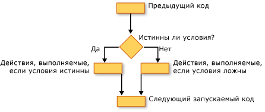

# Структуры решений (Visual Basic)
Visual Basic позволяет проверять условия и выполнять различные операции в зависимости от результата этого теста. Можно проверить условие true или false, для различных значений выражения, или для различных исключений, сформированных при выполнении последовательности инструкций.  
  
 На следующем рисунке структуру выбора, который проверяет условие и выполняет различные действия в зависимости от того, является ли это значение true или false.  
  
   
Выполняет различные действия, если условие имеет значение true, а также если он имеет значение false  
  
## If... Затем... Else построения  
 `If...Then...Else` позволяют проверить одно или несколько условий и запустить один или несколько операторов для каждого условия. Можно проверить условия и действий одним из следующих способов:  
  
-   Выполните один или несколько операторов, если условие равно `True`  
  
-   Выполните один или несколько операторов, если условие равно `False`  
  
-   Выполнить некоторые операторы, если условие равно `True` и другие — если `False`  
  
-   Проверить дополнительное условие, если предыдущее условие `False`  
  
 Управляющая структура, обеспечивающая все эти возможности — [Если... Затем... Оператор Else](../../../../visual-basic/language-reference/statements/if-then-else-statement.md). Если у вас есть только один тест и один оператор для запуска, можно использовать простую версию. При наличии более сложного набора условий и действий, можно использовать несколько строк версии.  
  
## Выберите... Конструкции case  
 `Select...Case` Позволяет вычислить выражение один раз и выполнить различные наборы операторов на основе различных значений. Дополнительные сведения см. в разделе [выберите... Оператор выбора](../../../../visual-basic/language-reference/statements/select-case-statement.md).  
  
## Try... CATCH... Наконец, создание  
 `Try...Catch...Finally` позволяют выполнять набор инструкций в среде, которая сохраняет контроль, если какой-либо инструкций вызовет исключение. Можно выполнять разные действия для различных исключений. При необходимости можно указать блок кода, который выполняется перед выходом из целого `Try...Catch...Finally` конструкции, независимо от того, что происходит. Дополнительные сведения см. в разделе [Оператор Try...Catch...Finally](../../../../visual-basic/language-reference/statements/try-catch-finally-statement.md).  
  
> [!NOTE]
>  Для многих управляющих структур при щелчке ключевого слова, все ключевые слова в структуре, выделяются. Например, при нажатии кнопки `If` в `If...Then...Else` конструкции, все экземпляры `If`, `Then`, `ElseIf`, `Else`, и `End If` выделяются при построении. Чтобы перейти к следующему или предыдущему выделенный ключевое слово, нажмите клавиши CTRL + SHIFT + СТРЕЛКА ВНИЗ или CTRL + SHIFT + Стрелка вверх.  
  
## См. также

- [Поток управления](../../../../visual-basic/programming-guide/language-features/control-flow/index.md)
- [Циклические структуры](../../../../visual-basic/programming-guide/language-features/control-flow/loop-structures.md)
- [Другие структуры управления](../../../../visual-basic/programming-guide/language-features/control-flow/other-control-structures.md)
- [Вложенные структуры управления](../../../../visual-basic/programming-guide/language-features/control-flow/nested-control-structures.md)
- [Оператор If](../../../../visual-basic/language-reference/operators/if-operator.md)
