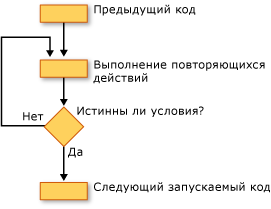

# Циклические структуры (Visual Basic)
Циклические структуры Visual Basic позволяют выполнять одну или несколько строк кода несколько раз. Операторы в циклической структуры можно повторять, пока условие `True`, пока условие `False`, указанное число раз или один раз для каждого элемента в коллекции.  
  
 На следующем рисунке структура цикла, выполняет набор инструкций, пока условие не станет true.  
  
   
Выполнение набора инструкций, пока условие не станет true  
  
## Циклы while  
 `While`... `End While` выполняет набор инструкций, пока условие, заданное в `While` инструкция является `True`. Дополнительные сведения см. в разделе [во время... Завершить оператор While](../../../../visual-basic/language-reference/statements/while-end-while-statement.md).  
  
## Do-циклы  
 `Do`... `Loop` позволяет проверить условие в начале или конце структуры цикла. Можно также указать, следует ли повторять цикл, пока значение условия равно `True` или пока она не станет `True`. Дополнительные сведения см. в разделе [сделать... Цикл инструкции](../../../../visual-basic/language-reference/statements/do-loop-statement.md).  
  
## Циклы for  
 `For`... `Next` выполняет заданное количество раз. Она использует переменную управления циклом, также называемый *счетчика*, чтобы отслеживать повторений. Можно указать начальное и конечное значения для этого счетчика и при необходимости можно указать суммы, по которому будет увеличен за одно повторение к следующему. Дополнительные сведения см. в разделе [для... Следующий оператор](../../../../visual-basic/language-reference/statements/for-next-statement.md).  
  
## Для каждого из циклов  
 `For Each`... `Next` выполняет набор инструкций один раз для каждого элемента в коллекции. Укажите управляющей переменной цикла, но нет определения ее начального или конечного значения. Дополнительные сведения см. в разделе [For Each... Следующий оператор](../../../../visual-basic/language-reference/statements/for-each-next-statement.md).  
  
## См. также  
 [Поток управления](../../../../visual-basic/programming-guide/language-features/control-flow/index.md)  
 [Структуры решений](../../../../visual-basic/programming-guide/language-features/control-flow/decision-structures.md)  
 [Другие структуры управления](../../../../visual-basic/programming-guide/language-features/control-flow/other-control-structures.md)  
 [Вложенные структуры управления](../../../../visual-basic/programming-guide/language-features/control-flow/nested-control-structures.md)
