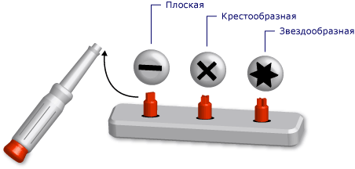

# Универсальные типы в Visual Basic (Visual Basic)
*Универсальный тип* является одиночным элементом программирования, который используется для выполнения одинаковой функциональности для различных типов данных. При определении универсальных классов или процедур не нужно определять отдельную версию для каждого типа данных, для которых может потребоваться выполнение этой функциональности.  
  
 В качестве аналогии можно привести отвертку со съемными головками. Вы смотрите на шуруп, который нужно завинтить, и выбираете подходящую головку (шлицевую, крестовую или звездообразную). Меняя головки, вы выполняете с помощью отвертки одну и ту же функцию: завинчиваете или вывинчиваете шуруп.  
  
   
Набор отверток в качестве универсального средства  
  
 При определении универсального типа его можно параметризовать с помощью одного или нескольких типов данных. Это позволяет использовать код, чтобы адаптировать типы данных к его требованиям. В коде можно объявить несколько различных элементов программирования из универсального элемента, каждый из которых действует для разных наборов типов данных. Но все объявленные элементы подчиняются одинаковой логике, независимо от того, какие типы данных они используют.  
  
 Допустим, вам нужно создать и использовать класс очереди, который работает с определенным типом данных, например `String`. Можно объявить класс из <xref:System.Collections.Generic.Queue%601?displayProperty=fullName>, как показано в следующем примере.</xref:System.Collections.Generic.Queue%601?displayProperty=fullName>  
  
 [!code-vb[VbVbalrDataTypes&#1;](../../../../visual-basic/language-reference/data-types/codesnippet/VisualBasic/generic-types_1.vb)]  
  
 Теперь можно использовать `stringQ` для работы исключительно со значениями `String` . Так как `stringQ` предназначен конкретно для `String` , а не является универсальным для значений `Object` , вам не потребуется позднее связывание или преобразование типа. Это экономит время выполнения и сокращает число ошибок во время выполнения.  
  
 Дополнительные сведения об использовании универсального типа см. в разделе [Практическое руководство: использование универсального класса](../../../../visual-basic/programming-guide/language-features/data-types/how-to-use-a-generic-class.md).  
  
## Пример универсального класса  
 В следующем примере показано определение каркаса универсального класса.  
  
 [!code-vb[VbVbalrDataTypes&#2;](../../../../visual-basic/language-reference/data-types/codesnippet/VisualBasic/generic-types_2.vb)]  
  
 В предыдущем каркасе `t` — это *параметр типа*, то есть заполнитель для типа данных, указанного при объявлении класса. В другом месте в коде можно объявлять различные версии `classHolder` , указав различные типы данных для `t`. Два таких объявления показаны в следующем примере.  
  
 [!code-vb[VbVbalrDataTypes&#3;](../../../../visual-basic/language-reference/data-types/codesnippet/VisualBasic/generic-types_3.vb)]  
  
 Предыдущие инструкции объявляют *сконструированные классы*, в которых указанный тип заменяет параметр типа. Эта замена распространяется по всему коду сконструированного класса. В следующем примере показано, как процедура `processNewItem` выглядит в `integerClass`.  
  
 [!code-vb[VbVbalrDataTypes&#4;](../../../../visual-basic/language-reference/data-types/codesnippet/VisualBasic/generic-types_4.vb)]  
  
 Более полный пример см. в разделе [как: определить класс, можно предоставить одинаковую функциональность с различными типами данных](../../../../visual-basic/programming-guide/language-features/data-types/how-to-define-a-class-that-can-provide-identical-functionality.md).  
  
## Допустимые элементы программирования  
 Можно определять и использовать универсальные классы, структуры, интерфейсы, процедуры и делегаты. Обратите внимание, что [!INCLUDE[dnprdnshort](../../../../csharp/getting-started/includes/dnprdnshort_md.md)] определяет несколько универсальных классов, структур и интерфейсов, которые представляют собой часто используемые универсальные элементы. <xref:System.Collections.Generic?displayProperty=fullName>Пространство имен предоставляет словари, списки, очереди и стеки.</xref:System.Collections.Generic?displayProperty=fullName> Перед определением собственного универсального элемента, проверьте, если он уже находится в папке <xref:System.Collections.Generic?displayProperty=fullName>.</xref:System.Collections.Generic?displayProperty=fullName>  
  
 Процедуры не являются типами, но можно определять и использовать универсальные процедуры. В разделе [универсальные процедуры в Visual Basic](../../../../visual-basic/programming-guide/language-features/data-types/generic-procedures.md).  
  
## Преимущества универсальных типов  
 Универсальный тип служит в качестве основы для объявления нескольких различных программных элементов, каждый из которых работает с определенным типом данных. Альтернативы для универсального типа:  
  
1.  одиночный тип, работающий с типом данных `Object` .  
  
2.  Набор *типозависимых* версий типа; каждая версия кодируется индивидуально и работает с одним конкретным типом данных (например `String`, `Integer`) или с определяемым пользователем типом, например `customer`.  
  
 Универсальный тип имеет следующие преимущества по сравнению с этими альтернативами.  
  
-   **Безопасность типа.** Универсальные типы обеспечивают проверку типов во время компиляции. Типы на основе `Object` принимают любой тип данных, и необходимо написать код, чтобы проверить, является ли тип входных данных приемлемым. При использовании универсальных типов компилятор может перехватить несоответствие типов до выполнения.  
  
-   **Производительность.** Универсальные типы не должны *упаковывать* и *unупаковывать* данные, так как каждый из них является специальным для одного типа данных. Операции, основанные на `Object` , должны упаковывать типы входных данных для их преобразования в `Object` и распаковать данные, предназначенные для вывода. Упаковка и распаковка снижают производительность.  
  
     Типы на основе `Object` имеют позднее связывание, а значит, для доступа к их элементам требуется дополнительный код во время выполнения. Это также снижает производительность.  
  
-   **Объединение кода.** Код в универсальном типе должен быть определен только один раз. Набор типозависимых версий типа должен реплицировать тот же код в каждой версии. Единственное отличие состоит в конкретном типе данных для этой версии. При использовании универсальных типов типозависимые версии формируются из исходного универсального типа.  
  
-   **Повторное использование кода.** Код, который не зависит от определенного типа данных, можно повторно использовать с различными типами данных, если он является универсальным. Часто его можно повторно использовать даже с типом данных, который изначально не предусматривался.  
  
-   **Поддержка интегрированной среды разработки.** При использовании сконструированного типа, объявленного из универсального типа, интегрированная среда разработки (IDE) может предоставить дополнительную поддержку при разработке кода. Например, IntelliSense может показать типозависимые параметры аргумента для конструктора или метода.  
  
-   **Универсальные алгоритмы.** Абстрактные алгоритмы, которые не зависят от типов, хорошо подходят для универсальных типов. Например универсальная процедура, которая сортирует пункты с помощью <xref:System.IComparable>интерфейса может использоваться с любым типом данных, который реализует <xref:System.IComparable>.</xref:System.IComparable> </xref:System.IComparable>  
  
## Ограничения  
 Несмотря на то, что код в определении универсального типа должен быть максимально независимым от типов, может потребоваться определенная возможность любого типа данных, указанного для универсального типа. Например, если вы хотите сравнить два элемента с целью сортировки или упорядочивания, их тип данных должен реализовывать <xref:System.IComparable>интерфейса.</xref:System.IComparable> Соблюдение этого требования можно обеспечить путем добавления *ограничения* к параметру типа.  
  
### Пример ограничения  
 В следующем примере показано определение класса с ограничением, которое требует аргумент типа для реализации <xref:System.IComparable>.</xref:System.IComparable> схемы  
  
 [!code-vb[VbVbalrDataTypes&#5;](../../../../visual-basic/language-reference/data-types/codesnippet/VisualBasic/generic-types_5.vb)]  
  
 Если последующий код попытается создать класс из `itemManager` используя тип, который не реализует <xref:System.IComparable>, компилятор сообщает об ошибке.</xref:System.IComparable>  
  
### Типы ограничений  
 Ограничение может содержать приведенные ниже требования в любой комбинации.  
  
-   Аргумент типа должен реализовывать один или несколько интерфейсов  
  
-   Аргумент типа должен наследовать только из одного класса или быть типом только одного класса.  
  
-   Аргумент типа должен предоставлять конструктор без параметров, доступный коду, который создает объекты из него.  
  
-   Аргумент типа должен быть *типом ссылки*или *типом значения*.  
  
 Если нужно задать более одного требования, используйте разделенный запятыми *список ограничений* , заключенный в фигурные скобки (`{ }`). Если требуется доступ к конструктору, включают [оператор New](../../../../visual-basic/language-reference/operators/new-operator.md) ключевое слово в списке. Чтобы требовать ссылочный тип, включите ключевое слово `Class` . Чтобы требовать тип значения, включите ключевое слово `Structure` .  
  
 Дополнительные сведения об ограничениях см. в разделе [список типов](../../../../visual-basic/language-reference/statements/type-list.md).  
  
### Пример множественных ограничений  
 В следующем примере показано каркасное определение универсального класса со списком ограничений в параметре типа. В коде, который создает экземпляр этого класса, аргумент типа должен реализовывать <xref:System.IComparable>и <xref:System.IDisposable>интерфейсы ссылочным типом и предоставлять доступ к конструктору без параметров.</xref:System.IDisposable> </xref:System.IComparable>  
  
 [!code-vb[VbVbalrDataTypes №&6;](../../../../visual-basic/language-reference/data-types/codesnippet/VisualBasic/generic-types_6.vb)]  
  
## Важные термины  
 Универсальные типы вводят и используют следующие термины.  
  
-   *Универсальный тип*. Определение класса, структуры, интерфейса, процедуры или делегата, для которого необходимо указать по крайней мере один тип данных при объявлении.  
  
-   *Параметр типа*. В определении универсального типа это заполнитель для типа данных, указываемый при объявлении типа.  
  
-   *Аргумент типа*. Определенный тип данных, который заменяет параметр типа при объявлении сконструированного типа из универсального типа.  
  
-   *Ограничение*. Условие для параметра типа, ограничивающее аргумент типа, который можно указать для него. Ограничение может требовать, чтобы аргумент типа реализовывал определенный интерфейс, был определенным классом или наследовал от него, имел доступный конструктор без параметров или был ссылочным типом или типом значения. Можно объединять эти ограничения, но невозможно указывать более одного класса.  
  
-   *Сконструированный тип*. Класс, структура, интерфейс, процедура или делегат, объявленный из универсального типа с помощью указания аргументов типа для параметров типа.  
  
## См. также  
 [Типы данных](../../../../visual-basic/programming-guide/language-features/data-types/index.md)   
 [Знаки типов](../../../../visual-basic/programming-guide/language-features/data-types/type-characters.md)   
 [Типы значений и ссылочные типы](../../../../visual-basic/programming-guide/language-features/data-types/value-types-and-reference-types.md)   
 [Преобразования типов в Visual Basic](../../../../visual-basic/programming-guide/language-features/data-types/type-conversions.md)   
 [Устранение неполадок типы данных](../../../../visual-basic/programming-guide/language-features/data-types/troubleshooting-data-types.md)   
 [Типы данных](../../../../visual-basic/language-reference/data-types/data-type-summary.md)   
 [Предложение Of (Visual Basic)](../../../../visual-basic/language-reference/statements/of-clause.md)   
 [Как](../../../../visual-basic/language-reference/statements/as-clause.md)   
 [Тип данных Object](../../../../visual-basic/language-reference/data-types/object-data-type.md)   
 [Ковариация и контрвариация](http://msdn.microsoft.com/library/a58cc086-276f-4f91-a366-85b7f95f38b8)   
 [Итераторы](http://msdn.microsoft.com/library/f45331db-d595-46ec-9142-551d3d1eb1a7)
