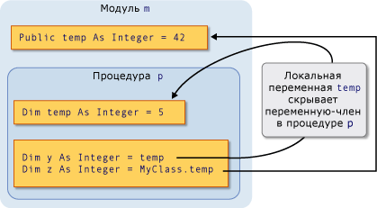
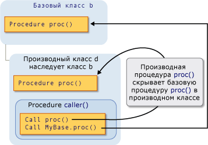

# <a name="shadowing-in-visual-basic"></a>Сокрытие в Visual Basic
Если два программных элемента имеют то же имя, один из них может скрыть, или *тени*, другой. В таком случае скрытый элемент недоступен для обращения. Вместо этого когда ваш код использует имя элемента, компилятор Visual Basic разрешает его скрывающий элемент.  
  
## <a name="purpose"></a>Цель  
 Основным предназначением затенения является защита определения членов класса. Базовый класс может претерпеть изменения, создается элемент с тем же именем, как один, которые уже определены. В этом случае `Shadows` применении модификатора ссылается в классе член быть определенный, а не новый элемент базового класса.  
  
## <a name="types-of-shadowing"></a>Типы затенения  
 Элемент можно скрывать другой элемент двумя различными способами. Переопределяющий элемент может быть объявлен внутри подобласти содержит скрытый элемент, в котором выполняется тогда затенение *посредством области*. Или производный класс может переопределить член базового класса, в котором происходит тогда затенение *через наследование*.  
  
### <a name="shadowing-through-scope"></a>Затемнения посредством области  
 Это программные элементы в модуле, классе или структуре могут иметь таким же именем, но разными областями действия. Если код ссылается на имя, они совместно используют два элемента объявляются таким образом, элемент с более узкой областью действия затеняет второй элемент (узкая — область видимости блока).  
  
 Например, модуль может определить `Public` переменную с именем `temp`, и процедура в модуле может объявить локальную переменную, которая также называется `temp`. Ссылки на `temp` внутри процедуры доступа к локальной переменной, а ссылки на `temp` из вне процедуры — к `Public` переменной. В данном случае переменная процедуры `temp` затеняет переменную модуля `temp`.  
  
 На следующем рисунке показано две переменные, обе с именем `temp`. Локальная переменная `temp` затеняет переменную-член `temp` при доступе из своей собственной процедуры `p`. Однако `MyClass` ключевое слово обходит затенение и обращается к переменной-члена.  
  
   
Затемнения посредством области  
  
 Пример затемнения посредством области см. в разделе [как: сокрытие переменной с тем же именем, как к переменной](../../../../visual-basic/programming-guide/language-features/declared-elements/how-to-hide-a-variable-with-the-same-name-as-your-variable.md).  
  
### <a name="shadowing-through-inheritance"></a>Затемнения посредством наследования  
 Если производный класс переопределяет программный элемент, наследуемый от базового класса, переопределенный элемент затеняет исходного элемента. Можно скрыть любой тип объявленного элемента, или набор перегруженных элементов с любым другим типом. Например `Integer` переменной можно скрыть `Function` процедуры. При скрытии процедуры другой можно использовать другой список параметров и другой тип возвращаемого значения.  
  
 На следующем рисунке показан базовый класс `b` и производный класс `d` , наследуемый от `b`. Базовый класс определяет процедуру с именем `proc`, и его скрывает производного класса с помощью другой процедуры с тем же именем. Первый `Call` оператор обращается к затенение `proc` в производном классе. Однако `MyBase` ключевое слово обходит затенение и обращается к затененной процедуре в базовом классе.  
  
   
Затемнения посредством наследования  
  
 Пример затемнения посредством наследования см. в разделе [как: сокрытие переменной с тем же именем, как к переменной](../../../../visual-basic/programming-guide/language-features/declared-elements/how-to-hide-a-variable-with-the-same-name-as-your-variable.md) и [как: скрывать унаследованные переменной](../../../../visual-basic/programming-guide/language-features/declared-elements/how-to-hide-an-inherited-variable.md).  
  
#### <a name="shadowing-and-access-level"></a>Затенение и уровень доступа  
 Переопределяющий элемент не всегда доступен из кода с помощью производного класса. Например, он может быть объявлен `Private`. В таком случае Затенение нарушается, и компилятор разрешает все ссылки на один элемент, который бы, если бы была затенения не. Этот элемент является наименьшем количестве последовательных шагов от переопределяющий класс доступного элемента. Если переопределяемый элемент является процедурой, разрешения является ближайший доступный с тем же именем, список параметров и тип возвращаемого значения.  
  
 В следующем примере показано иерархии наследования из трех классов. Каждый класс определяет `Sub` процедура `display`, и каждый производный класс затеняет `display` процедуры в базовом классе.  
  
```  
Public Class firstClass  
    Public Sub display()  
        MsgBox("This is firstClass")  
    End Sub  
End Class  
Public Class secondClass  
    Inherits firstClass  
    Private Shadows Sub display()  
        MsgBox("This is secondClass")  
    End Sub  
End Class  
Public Class thirdClass  
    Inherits secondClass  
    Public Shadows Sub display()  
        MsgBox("This is thirdClass")  
    End Sub  
End Class  
Module callDisplay  
    Dim first As New firstClass  
    Dim second As New secondClass  
    Dim third As New thirdClass  
    Public Sub callDisplayProcedures()  
        ' The following statement displays "This is firstClass".  
        first.display()  
        ' The following statement displays "This is firstClass".  
        second.display()  
        ' The following statement displays "This is thirdClass".  
        third.display()  
    End Sub  
End Module  
```  
  
 В предыдущем примере производный класс `secondClass` shadows `display` с `Private` процедуры. Если модуль `callDisplay` вызовы `display` в `secondClass`, вызывающий код находится за пределами `secondClass` и поэтому невозможно получить доступ к закрытым `display` процедуры. Затенение нарушается, и компилятор разрешает ссылку на базовый класс `display` процедуры.  
  
 Однако дополнительный производный класс `thirdClass` объявляет `display` как `Public`, поэтому код в `callDisplay` к нему возможен доступ.  
  
## <a name="shadowing-and-overriding"></a>Сокрытием и переопределением  
 Не следует путать затенение с переопределением. Оба метода используются, когда производный класс наследует от базового класса, и другое замещает один объявленный элемент другим. Но существуют значительные различия между ними. Сравнение см. в разделе [различия между сокрытием и переопределение](../../../../visual-basic/programming-guide/language-features/declared-elements/differences-between-shadowing-and-overriding.md).  
  
## <a name="shadowing-and-overloading"></a>Затенение и перегрузка  
 При скрытии же элемент с более чем одного элемента базового класса в производный класс, переопределяющий элементы становятся перегруженные версии этого элемента. Дополнительные сведения см. в разделе [перегрузка процедур](../../../../visual-basic/programming-guide/language-features/procedures/procedure-overloading.md).  
  
## <a name="accessing-a-shadowed-element"></a>Доступ к скрытый элемент  
 Обращение к элементу производного класса обычно происходит через текущий экземпляр этого класса путем указания имени элемента `Me` ключевое слово. Если производный класс скрывает элемент базового класса, можно получить доступ к элемент базового класса путем определения ее с `MyBase` ключевое слово.  
  
 Пример доступа к скрытый элемент, в разделе [как: доступ к переменной скрыто, класса, производного от](../../../../visual-basic/programming-guide/language-features/declared-elements/how-to-access-a-variable-hidden-by-a-derived-class.md).  
  
### <a name="declaration-of-the-object-variable"></a>Объявление переменной объекта  
 Как создать переменную объекта могут также влиять на ли производный класс обращается к скрывающий элемент или переопределяемый элемент. В следующем примере создается два объекта производного класса, но один объект объявлен как базовый класс, а другой — как производного класса.  
  
```  
Public Class baseCls  
    ' The following statement declares the element that is to be shadowed.  
    Public z As Integer = 100  
End Class  
Public Class dervCls  
    Inherits baseCls  
    ' The following statement declares the shadowing element.  
    Public Shadows z As String = "*"  
End Class  
Public Class useClasses  
    ' The following statement creates the object declared as the base class.  
    Dim basObj As baseCls = New dervCls()  
    ' Note that dervCls widens to its base class baseCls.  
    ' The following statement creates the object declared as the derived class.  
    Dim derObj As dervCls = New dervCls()  
    Public Sub showZ()   
    ' The following statement outputs 100 (the shadowed element).  
        MsgBox("Accessed through base class: " & basObj.z)  
    ' The following statement outputs "*" (the shadowing element).  
        MsgBox("Accessed through derived class: " & derObj.z)  
    End Sub  
End Class  
```  
  
 В предыдущем примере переменной `basObj` объявлен в качестве базового класса. Назначение `dervCls` объекта он реализует расширяющее преобразование и, соответственно, допустимо. Однако базовый класс не может получить доступ к скрывающий версии переменной `z` в производном классе, поэтому компилятор разрешает `basObj.z` к исходному значению базового класса.  
  
## <a name="see-also"></a>См. также  
 [Ссылки на объявленные элементы](../../../../visual-basic/programming-guide/language-features/declared-elements/references-to-declared-elements.md)  
 [Область в Visual Basic](../../../../visual-basic/programming-guide/language-features/declared-elements/scope.md)  
 [Расширяющие и сужающие преобразования](../../../../visual-basic/programming-guide/language-features/data-types/widening-and-narrowing-conversions.md)  
 [Shadows](../../../../visual-basic/language-reference/modifiers/shadows.md)  
 [Переопределения](../../../../visual-basic/language-reference/modifiers/overrides.md)  
 [Me, My, MyBase и MyClass](../../../../visual-basic/programming-guide/program-structure/me-my-mybase-and-myclass.md)  
 [Основы наследования](../../../../visual-basic/programming-guide/language-features/objects-and-classes/inheritance-basics.md)
