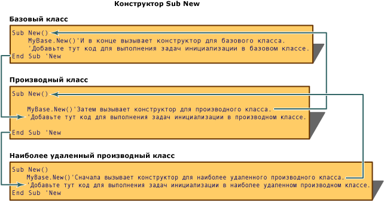
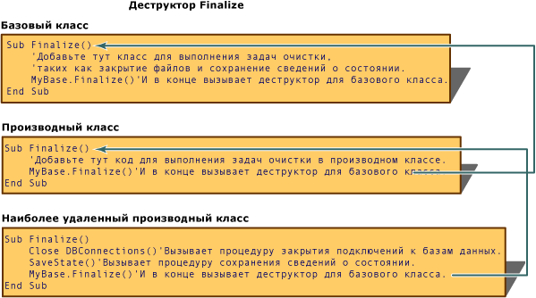

# <a name="object-lifetime-how-objects-are-created-and-destroyed-visual-basic"></a>Время существования: создание и уничтожение объектов (Visual Basic)
Экземпляр класса, объект, создается с помощью ключевого слова `New`. Задачи инициализации зачастую необходимо выполнять на новых объектах до их использования. К распространенным задачам инициализации относится открытие файлов, подключение к базам данных и чтение значений параметров реестра. Visual Basic контролирует инициализацию новых объектов с помощью процедур, называемых *конструкторы* (специальные методы, позволяющие контролировать инициализацию).  
  
 Когда объект выходит из области, он высвобождается средой CLR. Visual Basic контролирует освобождение системных ресурсов при помощи процедур, называемых *деструкторы*. Вместе конструкторы и деструкторы поддерживают создание надежных и предсказуемых библиотек класса.  
  
## <a name="using-constructors-and-destructors"></a>Использование конструкторов и деструкторов  
 Конструкторы и деструкторы управляют созданием и уничтожением объектов. Процедуры `Sub New` и `Sub Finalize` в Visual Basic инициализируют и уничтожают объекты. Они применяются вместо методов `Class_Initialize` и `Class_Terminate`, которые использовались в [!INCLUDE[vbprvb](../../../../csharp/programming-guide/concepts/linq/includes/vbprvb_md.md)] 6.0 и более ранних версиях.  
  
### <a name="sub-new"></a>Конструктор Sub New  
 Конструктор `Sub New` может быть запущен только один раз при создании класса. Его нельзя вызвать явным образом нигде, кроме первой строки кода другого конструктора этого же класса или производного класса. Более того, код метода `Sub New` всегда выполняется до любого другого кода в классе. [!INCLUDE[vbprvblong](../../../../visual-basic/developing-apps/customizing-extending-my/includes/vbprvblong_md.md)]и более поздних версиях неявно `Sub New` конструктора во время выполнения, если явно не определена `Sub New` процедуры для класса.  
  
 Чтобы создать конструктор класса, создайте процедуру с именем `Sub New` в любом месте определения класса. Чтобы создать конструктор с параметрами, укажите имена и типы данных аргументов в `Sub New` точно так же, как для любой процедуры. См. следующий код:  
  
 [!code-vb[VbVbalrOOP&#42;](../../../../visual-basic/misc/codesnippet/VisualBasic/object-lifetime-how-objects-are-created-and-destroyed_1.vb)]  
  
 Конструкторы часто перегружены, как в следующем коде:  
  
 [!code-vb[VbVbalrOOP&116;](../../../../visual-basic/misc/codesnippet/VisualBasic/object-lifetime-how-objects-are-created-and-destroyed_2.vb)]  
  
 При вызове класса, производного от другого класса, первая строка конструктора должна представлять собой вызов конструктора базового класса (кроме случаев, когда в базовом классе есть доступный конструктор, не принимающий параметры). Вызов базового класса, содержащего указанный выше конструктор, может быть, к примеру, таким `MyBase.New(s)`. В противном случае `MyBase.New`  не является обязательным, а среда выполнения [!INCLUDE[vbprvb](../../../../csharp/programming-guide/concepts/linq/includes/vbprvb_md.md)] вызывает его явным образом.  
  
 После написания кода для вызова конструктора родительского объекта можно добавить дополнительный код инициализации к процедуре `Sub New`. `Sub New` может принимать аргументы при вызове в качестве конструктора с параметрами. Эти параметры передаются из процедуры, вызывающей конструктор, например, `Dim AnObject As New ThisClass(X)`.  
  
### <a name="sub-finalize"></a>Sub Finalize  
 Перед высвобождением объектов среда CLR автоматически вызывает метод `Finalize` для объектов, определяющих процедуру `Sub Finalize`. Метод `Finalize` может содержать код, который необходимо выполнить непосредственно перед уничтожением объекта, например, код для закрытия файлов и сохранения информации о состоянии. Существует небольшой спад производительности при выполнении `Sub Finalize`, поэтому метод `Sub Finalize` нужно определять только в тех случаях, когда требуется явное высвобождение объектов.  
  
> [!NOTE]
>  В среде CLR сборщик мусора не выполняет и не может) избавиться от *неуправляемые объекты*, объекты, которые операционная система выполняет напрямую, вне среды CLR. Причина состоит в том, что разные неуправляемые объекты следует уничтожать по-разному. Эта информация не связана напрямую с неуправляемым объектом, ее необходимо найти в документации по объектам. Класс, использующий неуправляемые объекты, должен удалить их в своем методе `Finalize`.  
  
 Деструктор `Finalize` является защищенным методом, который можно вызвать только из класса, к которому он принадлежит, или из производного класса. Система автоматически вызывает `Finalize` при уничтожении объекта, поэтому не следует явным образом вызывать `Finalize` извне реализации `Finalize` производного класса.  
  
 В отличие от `Class_Terminate`, выполняющегося сразу же при уничтожении объекта, обычно существует пауза между потерей объектом области и вызовом деструктора `Finalize` в Visual Basic. [!INCLUDE[vbprvblong](../../../../visual-basic/developing-apps/customizing-extending-my/includes/vbprvblong_md.md)]и более поздних версиях поддерживается второй тип деструктора, <xref:System.IDisposable.Dispose%2A>, который можно явно вызывать в любое время, чтобы немедленно освободить ресурсы.</xref:System.IDisposable.Dispose%2A>  
  
> [!NOTE]
>  Деструктор `Finalize` не должен создавать исключений, поскольку они не обрабатываются приложением и могут привести к завершению работы приложения.  
  
### <a name="how-new-and-finalize-methods-work-in-a-class-hierarchy"></a>Как методы New и Finalize работают в иерархии классов  
 При каждом создании экземпляра класса среда CLR пытается выполнить процедуру `New`, если она существует в этом объекте. `New` — тип процедуры, которая называется `constructor` и используется для инициализации новых объектов до выполнения всего остального кода в объекте. Конструктор `New` можно использовать для открытия файлов, подключения к базам данных, инициализации переменных и для других задач, которые необходимо выполнить перед использованием объекта.  
  
 Когда создается экземпляр производного класса, конструктор `Sub New` базового класса выполняется в первую очередь, а затем — конструкторы в производных классах. Это происходит, поскольку первая строка кода в конструкторе `Sub New` использует синтаксис `MyBase.New()` для вызова конструктора класса на один уровень выше себя в иерархии классов. Затем конструктор `Sub New` вызывается для каждого класса в иерархии вплоть до достижения базового класса. На этом этапе выполняется код в конструкторе базового класса, а затем выполняется код в каждом конструкторе всех производных классов; код в производном классе самого дальнего уровня выполняется последним.  
  
   
  
 Когда объект больше не нужен, среда CLR вызывает <xref:System.Object.Finalize%2A>метод для этого объекта перед высвобождением памяти.</xref:System.Object.Finalize%2A> <xref:System.Object.Finalize%2A>Вызывается метод `destructor` , так как он выполняет задачи очистки, такие как сохранение данных о состоянии, закрытие файлов и подключений к базам данных и другие задачи, которые необходимо выполнить до освобождения объекта.</xref:System.Object.Finalize%2A>  
  
   
  
## <a name="idisposable-interface"></a>Интерфейс IDisposable  
 Экземпляры классов зачастую управляют ресурсами, которыми не управляет среда CLR, такими как дескрипторы Windows и подключения к базам данных. От этих ресурсов нужно избавляться в методе `Finalize` класса, поэтому они будут высвобождаться при уничтожении объекта сборщиком мусора. Тем не менее, сборщик мусора уничтожает объекты только в тех случаях, когда среде CLR нужно больше свободной памяти. Это означает, что ресурсы могут быть не высвобождены еще в течение долгого времени после того, как объект выйдет из области.  
  
 Чтобы дополнить сборку мусора, ваши классы могут предоставлять механизм активного управления системными ресурсами, если они реализуют <xref:System.IDisposable>интерфейса.</xref:System.IDisposable> <xref:System.IDisposable>содержит один метод <xref:System.IDisposable.Dispose%2A>, который следует вызывать клиентам при завершении использования объекта.</xref:System.IDisposable.Dispose%2A></xref:System.IDisposable> Можно использовать <xref:System.IDisposable.Dispose%2A>метод немедленно освободить ресурсы и выполнять задачи, такие как закрытие файлов и подключений к базе данных.</xref:System.IDisposable.Dispose%2A> В отличие от `Finalize` деструктор, <xref:System.IDisposable.Dispose%2A>метод не вызывается автоматически.</xref:System.IDisposable.Dispose%2A> Клиенты класса должны явным образом вызвать <xref:System.IDisposable.Dispose%2A>когда нужно немедленно высвободить ресурсы.</xref:System.IDisposable.Dispose%2A>  
  
### <a name="implementing-idisposable"></a>Использование IDisposable  
 Класс, реализующий <xref:System.IDisposable>интерфейса должен включать эти фрагменты кода:</xref:System.IDisposable>  
  
-   Поле, чтобы отслеживать, уничтожен ли объект:  
  
    ```  
    Protected disposed As Boolean = False  
    ```  
  
-   Перегрузка <xref:System.IDisposable.Dispose%2A>для высвобождения ресурсов класса.</xref:System.IDisposable.Dispose%2A> Этот метод должен вызываться <xref:System.IDisposable.Dispose%2A>и `Finalize` методы базового класса:</xref:System.IDisposable.Dispose%2A>  
  
    ```  
    Protected Overridable Sub Dispose(ByVal disposing As Boolean)  
        If Not Me.disposed Then  
            If disposing Then  
                ' Insert code to free managed resources.  
            End If  
            ' Insert code to free unmanaged resources.  
        End If  
        Me.disposed = True  
    End Sub  
    ```  
  
-   Реализация <xref:System.IDisposable.Dispose%2A>, содержащая только следующий код:</xref:System.IDisposable.Dispose%2A>  
  
    ```  
    Public Sub Dispose() Implements IDisposable.Dispose  
        Dispose(True)  
        GC.SuppressFinalize(Me)  
    End Sub  
    ```  
  
-   Переопределение метода `Finalize`, содержащее только следующий код:  
  
    ```  
    Protected Overrides Sub Finalize()  
        Dispose(False)  
        MyBase.Finalize()  
    End Sub  
    ```  
  
### <a name="deriving-from-a-class-that-implements-idisposable"></a>Производное создание от класса, реализующего IDisposable  
 Класс, производный от базового класса, который реализует <xref:System.IDisposable>интерфейс не требуется переопределять какие-либо из базовых методов, если он не использует дополнительные ресурсы, которые должны быть удалены.</xref:System.IDisposable> В этом случае производный класс должен переопределять метод `Dispose(disposing)` базового класса, чтобы удалить ресурсы производного класса. Это переопределение должно вызвать метод `Dispose(disposing)` базового класса.  
  
```  
Protected Overrides Sub Dispose(ByVal disposing As Boolean)  
    If Not Me.disposed Then  
        If disposing Then  
            ' Insert code to free managed resources.  
        End If  
        ' Insert code to free unmanaged resources.  
    End If  
    MyBase.Dispose(disposing)  
End Sub  
```  
  
 Производный класс не должен переопределять базовый класс <xref:System.IDisposable.Dispose%2A>и `Finalize` методы.</xref:System.IDisposable.Dispose%2A> Когда эти методы вызываются из экземпляра производного класса, реализация этих методов в базовом классе вызывает переопределение метода `Dispose(disposing)` производного класса.  
  
## <a name="garbage-collection-and-the-finalize-destructor"></a>Сбор мусора и деструктор Finalize  
 [!INCLUDE[dnprdnshort](../../../../csharp/getting-started/includes/dnprdnshort_md.md)] Использует *мусора с отслеживанием ссылок* системы, чтобы регулярно высвобождать неиспользуемые ресурсы. Visual Basic 6.0 и более ранних версий используется другая система под названием *подсчета ссылок* для управления ресурсами. Обе системы автоматически выполняют одну и ту же функцию, но есть несколько важных различий.  
  
 CLR периодически уничтожает объекты, если система определяет, что эти объекты больше не нужны. Объекты высвобождаются быстрее при нехватке системных ресурсов и медленнее в других случаях. Задержка между потерей объектом области и высвобождением объекта средой CLR означает, что в отличие от объектов в Visual Basic 6.0 и более ранних версиях, невозможно точно определить, когда объект будет уничтожен. В этом случае объекты говорят, что имеют *неопределенное время жизни*. В большинстве случаев неопределенное время жизни не влияет на написание приложений, если помнить о том, что деструктор `Finalize` может быть выполнен не сразу после потери объектом области.  
  
 Еще одно отличие от систем сборки мусора заключается в использовании `Nothing`. Чтобы воспользоваться подсчетом ссылок в Visual Basic 6.0 и более ранних версиях, программисты часто назначали `Nothing` переменным объектов, чтобы высвобождать ссылки, удерживаемые этими переменными. Если переменная содержала последнюю ссылку на объект, ресурсы объекта были немедленно высвобождены. В более поздних версиях Visual Basic, хотя по-прежнему могут быть случаи, когда эта процедура еще применима, ее выполнение больше не приводит к немедленному высвобождению ресурсов объектом. Чтобы немедленно освободить ресурсы, используйте метод объекта <xref:System.IDisposable.Dispose%2A>метод, если он доступен.</xref:System.IDisposable.Dispose%2A> Для переменной следует устанавливать значение `Nothing` лишь в тех случаях, когда ее время жизни достаточно велико по отношению ко времени, за которое сборщик мусора обнаруживает потерянные объекты.  
  
## <a name="see-also"></a>См. также  
 <xref:System.IDisposable.Dispose%2A></xref:System.IDisposable.Dispose%2A>   
 [Инициализация и прекращение работы компонентов](http://msdn.microsoft.com/library/58444076-a9d2-4c91-b3f6-0e180dc0695d)   
 [Оператор New](../../../../visual-basic/language-reference/operators/new-operator.md)   
 [Очистка неуправляемых ресурсов](http://msdn.microsoft.com/library/a17b0066-71c2-4ba4-9822-8e19332fc213)   
 [Nothing](../../../../visual-basic/language-reference/nothing.md)
