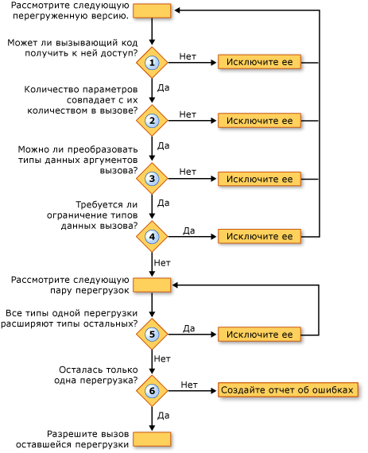

# Разрешение перегрузки (Visual Basic)
[!INCLUDE[vs2017banner](../../../../visual-basic/includes/vs2017banner.md)]

Когда компилятор [!INCLUDE[vbprvb](../../../../csharp/programming-guide/concepts/linq/includes/vbprvb-md.md)] обнаруживает вызов процедуры, определенной в нескольких перегруженных версиях, он должен определить, какую перегруженную версию необходимо вызвать.  Для этого компилятор выполняет следующие действия:  
  
1.  **Доступность.** Из рассмотрения исключаются те перегруженные версии, которые запрещают вызывающему коду их вызывать.  
  
2.  **Число параметров.** Из рассмотрения исключаются те перегруженные версии, в которых определено другое число параметров, чем задано в вызове.  
  
3.  **Типы данных параметров.** Компилятор предпочтительнее использует методы экземпляра, а не методам расширения.  Если найден метод экземпляра, требующий для сопоставления вызову процедуры только расширение widening, все методы расширения удаляются, и компилятор продолжает использовать только кандидаты метода экземпляра.  Если такой метод экзеспляра не найден, компилятор продолжает использовать как методы экземпляра, так и методы расширения.  
  
     На этом шаге из рассмотрения исключаются те перегруженные версии, для которых типы данных аргументов вызова не могут быть преобразованы в типы параметров, определенные в этой перегруженной версии.  
  
4.  **Сужающие преобразования.** Из рассмотрения исключаются те перегруженные версии, для которых требуется сужающее преобразование типов аргументов вызова в определенные типы параметров.  Это зависит от того, какое из значений имеет ключ проверки типов \([Оператор Option Strict](../../../../visual-basic/language-reference/statements/option-strict-statement.md)\) `On` или `Off`.  
  
5.  **Наименьшее расширение.** Компилятор рассматривают оставшиеся перегрузки парами.  Для каждой пары компилятор сравнивает типы данных определенных параметров.  Если в одной из перегрузок все типы расширяются до соответствующих типов другой перегрузки, компилятор исключает последнюю.  Другими словами, остается та перегрузка, которая требует меньшего расширения при преобразовании.  
  
6.  **Единственный вариант.** Компилятор продолжает рассматривать перегрузки попарно до тех пор, пока не останется только одна перегрузка, которая и вызывается.  Если этот процесс не сходится к единственной перегрузке, создается ошибка.  
  
 На следующем рисунке показан процесс, который определяет набор перегруженных версий для вызова.  
  
   
Разрешение в перегруженных версиях  
  
 В следующем прмере приведен процесс разрешения перегружаемых версий.  
  
 [!code-vb[VbVbcnProcedures#62](./codesnippet/VisualBasic/overload-resolution_1.vb)]  
  
 [!code-vb[VbVbcnProcedures#63](./codesnippet/VisualBasic/overload-resolution_2.vb)]  
  
 В первом вызове компилятор устраняет первую перегрузку, так как тип первого аргумента \(`Short`\) сужается к типу соответствующего параметра \(`Byte`\).  Затем исключаются третья перегрузка, так как каждый тип аргумента во второй перегрузке \(`Short` и `Single`\) может быть расширен до соответствующего типа в третьей перегрузке \(`Integer` и `Single`\).  Вторая перегруженная версия требует меньшего расширения, поэтому компилятор использует ее для вызова.  
  
 Во втором вызове компилятор не может устранить любую из перегрузок в зависимости от сужения.  Третья перегрузка исключается по той же причине, что и в первом вызове, поскольку можно вызвать вторую перегрузку с меньшим расширением типов аргументов.  Однако компилятору не удается выбрать между первой и второй перегрузками.  Каждая имеет один определенный тип параметра, который расширяется до соответствующего типа в другой \(`Byte` и `Short`, но `Single` и `Double`\).  Поэтому компилятор создает ошибку разрешения перегрузки.  
  
## Перегрузка необязательных аргументов и массива аргументов  
 Если две перегрузки процедуры имеют идентичные подписи, за исключением того, что последний параметр объявляется [Optional](../../../../visual-basic/language-reference/modifiers/optional.md) в одной и [ParamArray](../../../../visual-basic/language-reference/modifiers/paramarray.md) в другой, компилятор разрешает вызов процедуры, следующим образом:  
  
|||  
|-|-|  
|Если последний аргумент задан при вызове как|Компилятор вызывает перегрузку, в которой последний аргумент объявлен как|  
|Нет значения \(аргумент опущен\)|`Optional`|  
|Одиночное значение|`Optional`|  
|Два или несколько значений, разделенных запятыми|`ParamArray`|  
|Массив произвольной длины \(в частности, пустой массив\)|`ParamArray`|  
  
## См. также  
 [Необязательные параметры](../../../../visual-basic/programming-guide/language-features/procedures/optional-parameters.md)   
 [Массивы параметров](../../../../visual-basic/programming-guide/language-features/procedures/parameter-arrays.md)   
 [Перегрузка процедур](../../../../visual-basic/programming-guide/language-features/procedures/procedure-overloading.md)   
 [Устранение неполадок в процедурах](../../../../visual-basic/programming-guide/language-features/procedures/troubleshooting-procedures.md)   
 [Практическое руководство. Определение различных версий процедуры](../../../../visual-basic/programming-guide/language-features/procedures/how-to-define-multiple-versions-of-a-procedure.md)   
 [Практическое руководство. Вызов перегруженной процедуры](../../../../visual-basic/programming-guide/language-features/procedures/how-to-call-an-overloaded-procedure.md)   
 [Практическое руководство. Перегрузка процедуры, которая принимает один необязательный параметр](../../../../visual-basic/programming-guide/language-features/procedures/how-to-overload-a-procedure-that-takes-optional-parameters.md)   
 [Практическое руководство. Перегрузка процедуры, принимающей неопределенное число параметров](../../../../visual-basic/programming-guide/language-features/procedures/how-to-overload-a-procedure-that-takes-an-indefinite-number-of-parameters.md)   
 [Вопросы, связанные с перегрузкой процедур](../../../../visual-basic/programming-guide/language-features/procedures/considerations-in-overloading-procedures.md)   
 [Overloads](../../../../visual-basic/language-reference/modifiers/overloads.md)   
 [Методы расширения](../../../../visual-basic/programming-guide/language-features/procedures/extension-methods.md)