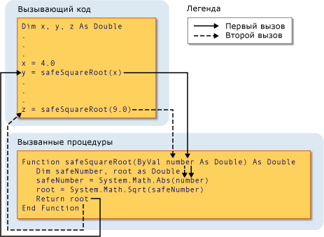

# Параметры и аргументы процедуры (Visual Basic)
В большинстве случаев процедуре требуется некоторая информация о ситуациях, в которых она была вызвана. Процедура, которая выполняет повторяющуюся задачу использует различные сведения для каждого вызова. Эта информация состоит из переменных, констант и выражений, которые передаются процедуре при ее вызове.  
  
 Объект *параметр* представляет значение, которое процедура необходимо указать при ее вызове. Объявление процедуры определяет его параметры.  
  
 Можно определить процедуру без параметров, один параметр или несколько. Часть определения процедуры, которое указывает параметры, называется *список параметров*.  
  
 *Аргумент* представляет значение, указываемое в параметрах процедуры при вызове процедуры. Вызывающий код не предоставляет аргументы при вызове процедуры. Часть вызова процедуры, которая определяет аргументы, называется *список аргументов*.  
  
 На следующем рисунке показан код вызова процедуры `safeSquareRoot` из двух различных местах. Первый вызов передает значение переменной `x` (4.0) в параметр `number`и возвращаемое значение в `root` (2.0) присваивается переменной `y`. Второй вызов передает значение литерала 9.0 в `number`и присваивает возвращаемое значение (3.0) переменной `z`.  
  
   
Передача аргумента в параметр  
  
 Дополнительные сведения см. в разделе [различия между параметрами и аргументами](./differences-between-parameters-and-arguments.md).  
  
## Тип данных параметра  
 Определить тип данных для параметра с помощью `As` предложение в его объявлении. Например следующая функция принимает строку и целое число.  
  
 [!code-vb[VbVbcnProcedures#32](./codesnippet/VisualBasic/procedure-parameters-and-arguments_1.vb)]  
  
 Если переключатель проверки типа ([оператор Option Strict](../../../../visual-basic/language-reference/statements/option-strict-statement.md)) является `Off,` `As` предложение необязательно, за исключением того, если любой из параметров использует его, его необходимо использовать все параметры. Если проверка типов не `On`, `As` предложение является обязательным для всех параметров процедуры.  
  
 Если вызывающий код ожидает указания аргумента с типом данных, отличному от соответствующего параметра, такие как `Byte` для `String` параметра, он должен выполнить одно из следующих действий:  
  
-   Указать только аргументы с типами данных, которые расширяются до типа данных параметра;  
  
-   Задать `Option Strict Off` чтобы разрешить неявные сужающие преобразования; или  
  
-   Используйте ключевое слово преобразования для явного преобразования типа данных.  
  
### Параметры типа  
 Объект *универсальной процедуры* также определяет один или несколько *параметры типа* в дополнение к его обычным параметрам. Универсальная процедура позволяет вызывающему коду для передачи различных типов данных при каждом вызове процедуры, поэтому его можно адаптировать типы данных для каждого отдельного вызова требования. См. раздел [Generic Procedures in Visual Basic](../../../../visual-basic/programming-guide/language-features/data-types/generic-procedures.md).  
  
## См. также  
 [Процедуры](./index.md)  
 [Подпрограммы](./sub-procedures.md)  
 [Процедуры функций](./function-procedures.md)  
 [Процедуры свойств](./property-procedures.md)  
 [Процедуры операторов](./operator-procedures.md)  
 [Практическое руководство. Определение параметра для процедуры](./how-to-define-a-parameter-for-a-procedure.md)  
 [Практическое руководство. Передача аргументов в процедуру](./how-to-pass-arguments-to-a-procedure.md)  
 [Передача аргументов по значению и по ссылке](./passing-arguments-by-value-and-by-reference.md)  
 [Перегрузка процедур](./procedure-overloading.md)  
 [Преобразования типов в Visual Basic](../../../../visual-basic/programming-guide/language-features/data-types/type-conversions.md)
